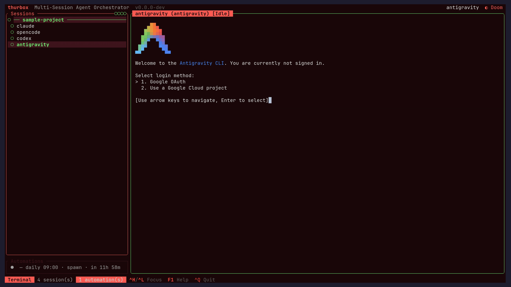
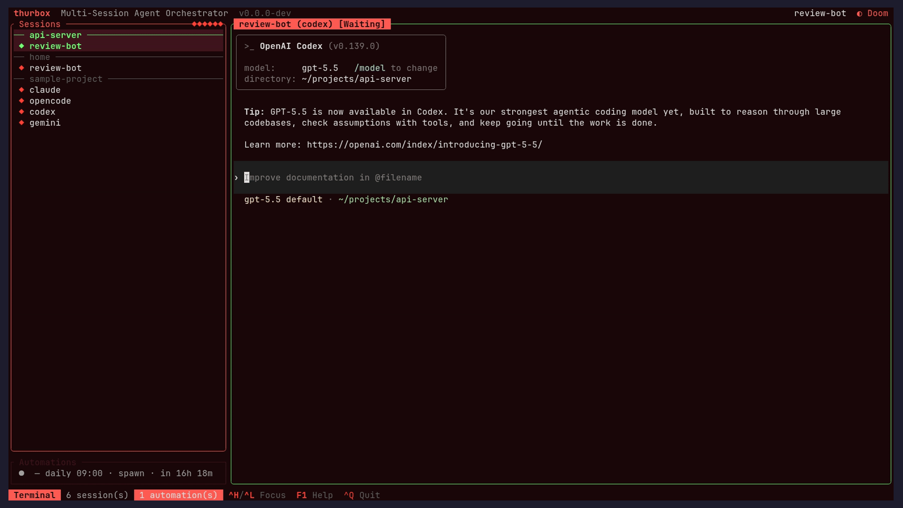
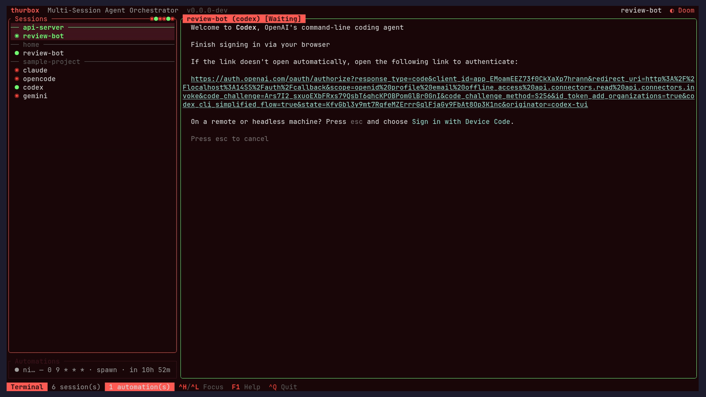
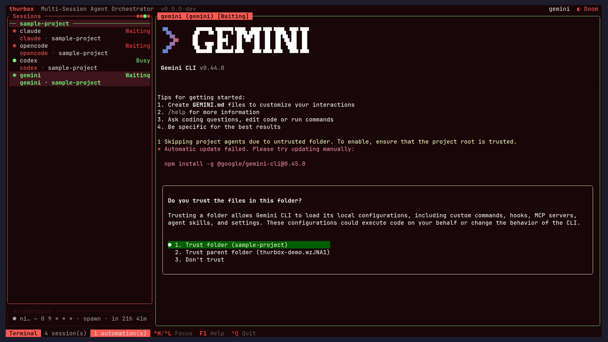
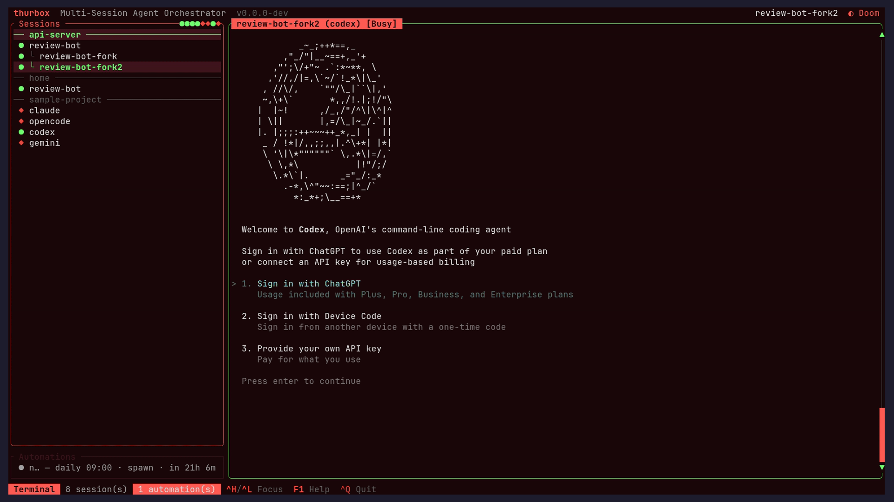
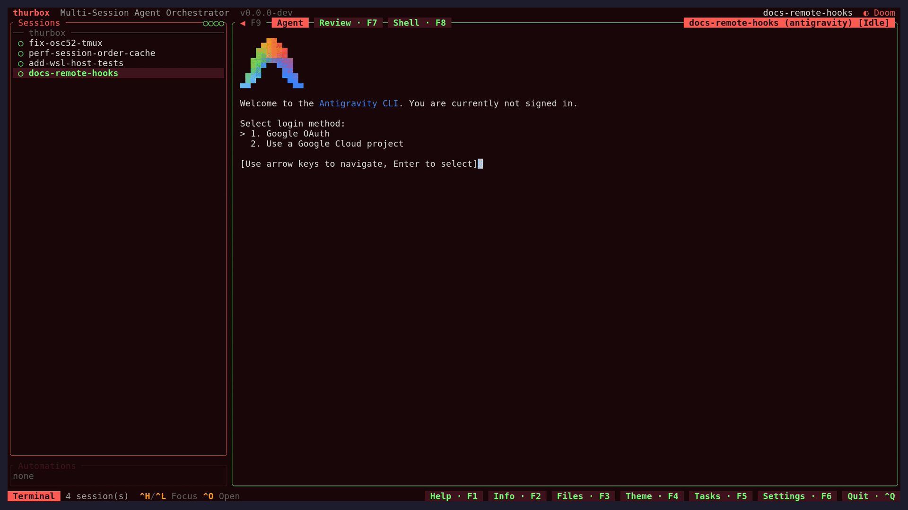
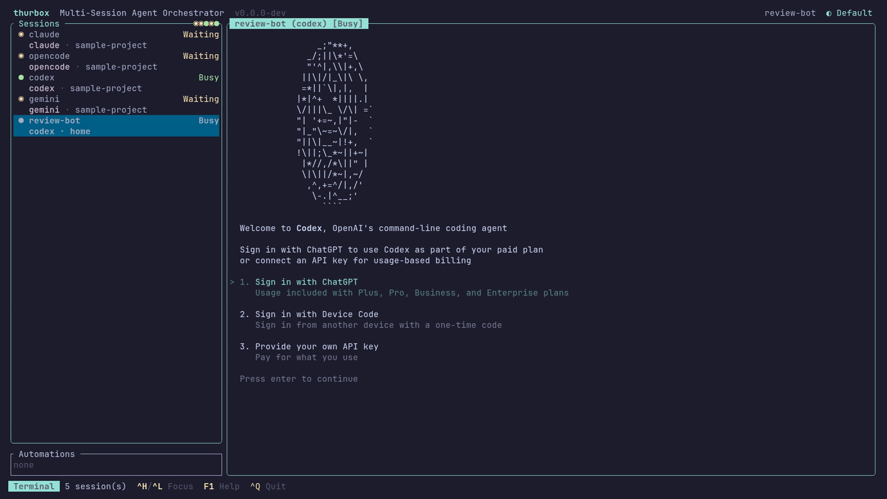
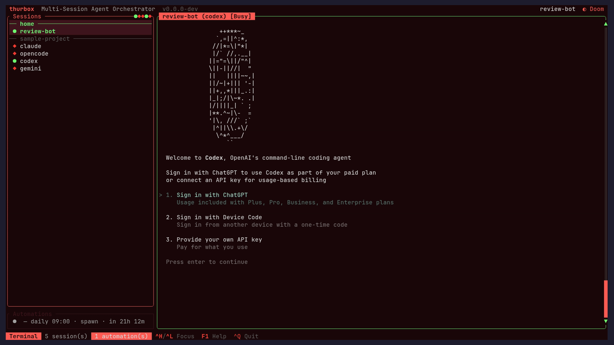

# Thurbox

Run any coding-agent CLI in persistent terminal sessions.
Thurbox is a multi-session TUI orchestrator that launches
Claude Code, Codex, Gemini CLI, opencode, aider — or any agent
you describe — inside persistent tmux panes that survive
crashes, restarts, and reboots. Sessions, agents, and git
worktrees are first-class citizens.

[](https://github.com/Thurbeen/thurbox/actions)
[](https://opensource.org/licenses/MIT)
[](https://thurbox.thurbeen.eu/)
[](https://sonarcloud.io/summary/new_code?id=Thurbeen_thurbox)


## Why Thurbox

Running a coding agent in several terminals gets you far — until
you want to keep sessions alive across crashes, isolate them
per-branch, or juggle different agents side-by-side. Thurbox
adds:

- **Persistence** — sessions live in tmux and survive Thurbox
  crashes, restarts, and reboots. Reattach from any terminal with
  `tmux -L thurbox attach`.
- **Parallelism** — many agents side-by-side, each on its own
  repo(s) and branch, each running the agent you chose.
- **Any agent** — a session runs one coding-agent CLI selected at
  creation time. Built-ins (claude, codex, gemini, opencode,
  aider, vibe) are seeded into `~/.config/thurbox/agents.toml`; add your
  own without recompiling.
- **Git worktree isolation** — each session can spawn on a fresh
  worktree; `Ctrl+S` syncs them with `origin/main` and asks the
  agent to resolve rebase conflicts automatically.

## Main Features

### Sessions

- Persistent tmux-backed panes, parallel agents, per-session
  working dirs.
- Each session runs one coding agent; nothing else is configured
  per session. Each agent runs with its own default config.
- `Ctrl+R` restart preserves the conversation when the agent
  supports resume; `Ctrl+F` forks a session; `Ctrl+T` toggles a
  shell pane.
- Fuzzy session search (`/`), clickable URLs, mouse selection +
  clipboard, automations (`Ctrl+P`), soft-delete with undo
  (`Ctrl+Z`) and restore (`Ctrl+U`).

> **Note:** The session list display is not yet perfect and will
> keep improving. What it can show is heavily dependent on the
> signals each agent CLI exposes.

Create one with `Ctrl+N` — pick a repo, name it, choose an agent:



Fork one with `Ctrl+F` — the copy records the source as its
**parent**, and children nest under their parent in the session
list:



### Automations

- Named, scheduled agent runs — one-shot or recurring (cron, with
  friendly `hourly`/`daily`/`weekdays`/`weekly` presets). When one
  fires it either **sends** a prompt to a running session or
  **spawns** a fresh session (optionally on a new worktree) and
  prompts it.
- A dedicated **Automations pane** sits below the session list;
  focus it and press `Ctrl+N` to create (or `Space`/`r`/`e`/`d` to
  toggle/run/edit/delete). The editor needs no cron knowledge — the
  trigger is a selector and the time is set with steppers, with a
  live "next fire" preview.
- Fires even when the TUI is closed via a tmux heartbeat keeper
  (with opt-in systemd/launchd units for reboot-proof firing), and
  is fully scriptable headless: `thurbox-cli automation
  create/list/edit/run/tick`.

> **Note:** Automations are stable and good enough for daily use
> today, but the feature may still evolve.



### Tasks

- A built-in **todo list** whose items can be **connected to a
  coding agent** with the same Send/Spawn model as automations:
  **Send** pastes the task title into an existing session,
  **Spawn** creates a fresh session (optionally on a new worktree)
  seeded with the title, and an unconnected task is a plain local
  todo. Triggering a task (`r`) runs its action and advances it to
  *in progress*.
- Tasks live in a **toggleable right-side column** (`Ctrl+W` /
  `F5`) that behaves like the file viewer. Focus it and press `n`
  to create, `e`/`Enter` to edit (an in-pane editor, no popup),
  `Space` to cycle status (☐ todo · ◐ in progress · ☑ done), and
  `d` to delete.
- Fully scriptable headless: `thurbox-cli task` (alias `todo`) —
  `create`/`list`/`show`/`edit`/`remove`/`run`. External
  issue-tracker sync (Jira, GitHub Issues) is scaffolded for a
  later release.

> **Note:** Tasks are a new feature — expect the UX and UI to keep
> evolving in upcoming releases.



### Flow extension

- An opt-in, **agent-agnostic** add-on (`extensions/flow/`) that
  turns the task list into a focus-protecting workflow: brain-dump
  at a dedicated cheap **flow session** and it captures everything
  into tasks, dispatches the dispatchable ones to worker sessions
  (each on its own `flow/<slug>` worktree branch), monitors them
  via a tick automation, and ends every reply with the single next
  thing to focus on.
- The triager and the workers are plain `agents.toml` aliases
  (`flow`, `flow-worker`, `flow-worker-heavy`) — map them to
  claude, codex, gemini, opencode, vibe, or anything else. The
  behavior is a plain context file (`FLOW.md`) surfaced to
  whichever CLI you pick via `CLAUDE.md`/`AGENTS.md`/`GEMINI.md`
  symlinks.
- One-line install (idempotent):

  ```bash
  curl -fsSL https://raw.githubusercontent.com/Thurbeen/thurbox/main/extensions/flow/install.sh | sh
  ```

> **Note:** The flow extension is a brand-new, **experimental**
> feature under active testing — expect its behavior, spec, and
> installer to change between releases.

See [`extensions/flow/README.md`](./extensions/flow/README.md).

### Global search

- One key (`Ctrl+A`) opens a **non-modal search strip** that
  searches **every scope at once** — sessions (name/agent/branch
  **and** live terminal-buffer content), tasks, automations, and
  the active session's file tree.
- Matches **highlight live in the panels themselves** (matching
  rows accented, the rest dimmed), with per-scope match counts and
  a grouped result list. `Enter` jumps to the selected result and
  focuses its pane; `Esc` restores exactly what you had before
  searching.



### Agent definitions

- Agents are declared as data in `~/.config/thurbox/agents.toml`,
  seeded with built-ins on first run and user-extensible. Each
  agent has a `command`, `args` (always passed — bake in flags
  like a model here if you want), and argument-template groups
  (`resume_args`, `fork_args`, `new_session_args`). Each group is
  appended only when its value is present, with `{id}`
  substituted.

### Git worktrees

- Pick "Worktree" in the new-session flow to branch off a base and
  launch the agent inside the worktree. Closing the session removes
  it. `Ctrl+S` syncs all worktree sessions with `origin/main`.

### Remote SSH sessions

- Run an agent on a **remote machine** over SSH while the TUI stays
  local. Declare hosts in `~/.config/thurbox/hosts.toml` (seeded
  commented-out, so a fresh install has none); each entry becomes a
  selectable backend named `ssh:<name>`. The new-session flow shows a
  **host picker** first, and remote sessions are marked with a `☁`
  glyph in the list.
- The agent process, its tmux window, and any git worktrees all live
  on the remote host. thurbox shells out to your system `ssh`, so
  authentication, keys, and multiplexing come from `~/.ssh/config` —
  thurbox never handles credentials. Remote sessions get the same
  persistence, multi-instance sharing, and restore-on-startup as
  local ones.

  ```toml
  # ~/.config/thurbox/hosts.toml
  [[hosts]]
  name = "devbox"            # backend "ssh:devbox"; what --host expects
  destination = "me@devbox"  # ssh target or a ~/.ssh/config alias
  ssh_opts = ["-o", "ControlMaster=auto", "-o", "ControlPersist=10m"]
  # socket / session  — optional remote tmux -L / session-name overrides
  # worktrees_dir      — optional absolute remote worktrees dir
  ```

  Spawn remotely from the CLI with `thurbox-cli session create
  --host devbox …` (see [Headless CLI](#headless-cli-thurbox-cli)).
  The remote host needs **tmux >= 3.2** and **git**.

### Responsive UI

- `< 80` cols: terminal only · `>= 80`: sidebar + terminal ·
  `>= 120`: sidebar + terminal + info panel. Vim-inspired keys
  throughout. Pick a theme with `Ctrl+Y` (or `F4`).

The **info panel** (`Ctrl+B`) shows per-session details and live
CPU/RAM and agent metrics:



The **file viewer** (`Ctrl+E`) browses the session's worktree
tree with fuzzy search:



Nine themes (five dark, four light) switch live with `Ctrl+Y`:



## Prerequisites

- **tmux >= 3.2**
- **A coding-agent CLI** — e.g.
  [claude](https://github.com/anthropics/claude-code), codex,
  gemini, opencode, or aider (whichever agents you plan to run)
- **git** (required for worktree features)
- **Rust 1.75+** (only to build from source)

## Installation

**One-liner (recommended):**

```bash
curl -fsSL https://raw.githubusercontent.com/Thurbeen/thurbox/main/scripts/install.sh | sh
```

Installs the latest release to `~/.local/bin` with checksum
verification and platform auto-detection.

**Options:**

```bash
# Custom directory
INSTALL_DIR=/usr/local/bin curl -fsSL https://raw.githubusercontent.com/Thurbeen/thurbox/main/scripts/install.sh | sh

# Pin a version
VERSION=v0.1.0 curl -fsSL https://raw.githubusercontent.com/Thurbeen/thurbox/main/scripts/install.sh | sh
```

**Homebrew (macOS / Linux):**

```bash
brew install thurbeen/thurbox/thurbox
```

Installs the prebuilt release binaries (`thurbox` + `thurbox-cli`)
from the [tap](https://github.com/Thurbeen/homebrew-thurbox), with
`tmux` and `git` pulled in as dependencies. Supports macOS arm64
(Apple Silicon) and Linux x86_64.

**Arch Linux (AUR):**

Thurbox is on the AUR as
[`thurbox`](https://aur.archlinux.org/packages/thurbox) (builds
from source) and
[`thurbox-bin`](https://aur.archlinux.org/packages/thurbox-bin)
(prebuilt release binary). Install with your AUR helper:

```bash
paru -S thurbox-bin   # prebuilt binary (fastest)
paru -S thurbox       # build from source
```

`tmux` is pulled in as a dependency. (Swap `paru` for `yay` or
your preferred helper.)

**From source:**

```bash
sudo pacman -S --needed git tmux rust   # Arch deps; use your distro's equivalent
git clone https://github.com/Thurbeen/thurbox.git
cd thurbox
cargo build --release
# binary at target/release/thurbox
```

## Uninstall

Remove the binary, depending on how you installed it:

```bash
rm ~/.local/bin/thurbox        # curl one-liner / manual install
brew uninstall thurbox         # Homebrew
paru -R thurbox thurbox-bin    # Arch (AUR)
```

Sessions outlive Thurbox in tmux, so stop them too:

```bash
tmux -L thurbox kill-server    # ends all running agent sessions
```

To also delete state and config (optional — this erases your
session history, theme, and `agents.toml`):

```bash
rm -rf ~/.local/share/thurbox ~/.config/thurbox
```

## Getting Started

1. **Launch** — run `thurbox`. You'll see a sidebar on the left
   listing your sessions and a terminal panel on the right.
2. **Create your first session** — press `Ctrl+N` to open the repo
   picker. Toggle repos with `Space`; press `w` on a repo to mark
   it as worktree mode (you'll be prompted for a base branch and
   new branch name). Confirm with `Enter`, name the session, then
   pick an **agent**. The agent picker is skipped when only one
   agent is defined.
3. **Work with the agent** — the right pane is a live agent
   session. All keys are forwarded to the PTY; `Ctrl+C` copies if
   you have a selection, otherwise sends SIGINT.
4. **Navigate** — `Ctrl+J` / `Ctrl+K` move between sessions in the
   sidebar; `Ctrl+L` / `Ctrl+H` cycle focus between panes.
   `Ctrl+O` opens the session's worktree in your editor.
5. **Quit without killing** — `Ctrl+Q` detaches all sessions.
   Tmux keeps them running; relaunch `thurbox` and they resume.

See the full [keybindings](#keybindings) below.

## Agents

A session launches exactly one coding-agent CLI. Agents are
described as data in `~/.config/thurbox/agents.toml`, which is
seeded with built-ins (claude, codex, gemini, opencode, aider,
vibe) on first run. Edit the file to tweak an agent or add a new one — no
recompile required.

Each `[[agents]]` entry maps the resume / fork / new-session ids
onto argument-template groups. `args` is always passed (bake in
any flags you want, e.g. a model); the resume / fork /
new-session groups are appended only when their driving value is
present, with `{id}` substituted token-by-token:

```toml
default = "claude"

[[agents]]
name = "claude"
command = "claude"
resume_args = ["--resume", "{id}"]
fork_args = ["--resume", "{id}", "--fork-session"]
new_session_args = ["--session-id", "{id}"]

[[agents]]
name = "codex"
command = "codex"
```

## Common Workflows

- **Parallel branches** — `Ctrl+N`, pick a repo in Worktree mode,
  name a new branch. Repeat for a second branch. Two isolated
  agents now work in parallel with no git contention.
- **Mix agents** — run Claude Code on one repo and Codex on
  another in side-by-side sessions; each session remembers its own
  agent.
- **Recover a crash** — if Thurbox dies, relaunch it: sessions
  resume from tmux. Prefer raw tmux? `tmux -L thurbox attach`.

## Keybindings

### Global Keys

| Key | Action | Mnemonic |
|-----|--------|----------|
| `Ctrl+Q` | Quit (detach sessions) | **Q**uit |
| `Ctrl+N` | New session (opens repo picker) | **N**ew |
| `Ctrl+C` | Copy selection / SIGINT (terminal) | **C**opy |
| `Ctrl+V` | Paste from clipboard | Paste |
| `Ctrl+P` | Automations (list/new/edit/toggle/run/delete) | **P**rogram |
| `Ctrl+T` | Toggle shell pane | **T**erminal |
| `Ctrl+H` | Focus previous pane (cycle backward) | Vim: **h** = left |
| `Ctrl+J` | Select next session | Vim: **j** = down |
| `Ctrl+K` | Select previous session | Vim: **k** = up |
| `Ctrl+L` | Focus next pane (cycle forward) | Vim: **l** = right |
| `Ctrl+D` | Delete session | Vim: **d** = delete |
| `Ctrl+O` | Open active session's working dirs in editor | **O**pen |
| `Ctrl+R` | Restart active session | **R**estart |
| `Ctrl+F` | Fork active session | **F**ork |
| `Ctrl+S` | Sync worktrees with origin/main | **S**ync |
| `Ctrl+Z` | Undo session delete | **Z** = undo |
| `Ctrl+U` | Restore deleted sessions | **U**ndelete |
| `Ctrl+Y` / `F4` | Pick TUI theme | Color **Y**oke |
| `F1` | Help overlay | Universal |
| `F2` | Toggle info panel | Next to F1 |
| `F3` | Toggle file viewer | Next to F2 |

**macOS:** in kitty-protocol terminals (iTerm2 3.5+, kitty, WezTerm,
Ghostty) the Command key works as a modifier — `Cmd+J`/`Cmd+Shift+J`
switch sessions and `Cmd+L`/`Cmd+Shift+L` cycle panes by default, and
any action can be rebound to a `cmd+…` chord from the F1 editor.
Terminal.app delivers no Cmd chords; everything else works there.

### List Navigation

| Key | Action |
|-----|--------|
| `j` / `Down` | Next item |
| `k` / `Up` | Previous item |
| `/` | Fuzzy search (projects or sessions) |
| `Enter` | Select / focus |

Session search matches against name, agent, and branch.

### Terminal Scrollback and Selection

| Key | Action |
|-----|--------|
| `Shift+Up` / `Shift+Down` | Scroll 1 line |
| `Shift+PageUp` / `Shift+PageDown` | Scroll half page |
| `Alt+PageUp` / `Alt+PageDown` | Scroll half page (fallback where the terminal claims `Shift+Page`, e.g. Terminal.app/iTerm2) |
| Mouse wheel | Scroll 3 lines |
| Mouse drag | Select text |
| Any other key | Snap to bottom + forward to PTY |

## Headless CLI (`thurbox-cli`)

The `thurbox-cli` binary drives Thurbox without the TUI — useful
for scripting and automation. It shares the same SQLite database
and `tmux -L thurbox` server as the TUI, so changes made by either
appear live in the other (the TUI polls `PRAGMA data_version`).

Every command prints a JSON result to stdout; pass the global
`--pretty` flag for indented output. The binary is intentionally
thin — it parses arguments, calls into the database / tmux helpers,
and prints the result. There is no TUI and no event loop.

```bash
cargo build --bin thurbox-cli
```

### Sessions

```bash
thurbox-cli session list                 # all active sessions
thurbox-cli session get <uuid>           # one session by UUID
thurbox-cli session create \
  --name reviewer \
  --repo-path /path/to/repo \
  --agent codex \
  --worktree-branch feat/x \
  --base-branch main \
  --host devbox          # optional — run on a remote host from hosts.toml
thurbox-cli session send <uuid> "run the test suite"
thurbox-cli session capture <uuid> --lines 500
thurbox-cli session restart <uuid>       # kill + re-spawn with --resume
thurbox-cli session delete <uuid>        # soft-delete (see below)
thurbox-cli session restore <uuid>       # undo a soft-delete
```

- **`create`** runs synchronously — the tmux window is live by the
  time the command returns. `--agent` falls back to the default in
  `agents.toml` when omitted; `--worktree-branch` (off
  `--base-branch`, default `main`) creates a git worktree; `--host`
  (a name from `hosts.toml`) creates the worktree and tmux window on
  that remote host over SSH instead of locally.
- **`send`** types text into the session's terminal followed by
  Enter; **`capture`** dumps the rendered pane as text (`--lines`
  defaults to 200, max 10000).

#### How session delete is handled

`session delete <uuid>` is a **soft-delete**: by default it only
marks the database row as deleted. The tmux window, any git
worktrees, and pending scheduled commands are **left untouched** —
the running TUI cleans those up on its next sync, and the session
stays recoverable with `session restore <uuid>` (the TUI's `Ctrl+U`
/ `Ctrl+Z` undo path). Restore revives the metadata; the TUI
re-spawns a fresh window for it.

Pass **`--force`** to also tear down the session's runtime resources
in the same call — useful for headless cleanup when no TUI is
running to observe the deletion. With `--force` the command:

- kills the tmux window,
- removes the session's git worktrees (the underlying repos are left
  intact),
- removes the multi-repo symlink workspace, if any (only the
  symlinks — never the linked repos), and
- disables any `send` automations that target the session.

Teardown is **best-effort**: individual tmux/worktree failures are
recorded in the JSON report (`killed_window`, `removed_worktrees`,
`worktree_errors`, `disabled_automations`) but never abort the
delete. The DB row is always soft-deleted last, so even a forced
delete remains restorable (it just re-spawns from a clean slate).

### Automations (alias `auto`)

Scheduled agent runs, persisted to the shared DB. See
[Automations](#automations) for the model.

```bash
thurbox-cli automation create \
  --name nightly-triage \
  --trigger weekdays --time 09:00 \
  --session <uuid> --prompt "triage new issues"
thurbox-cli automation list
thurbox-cli automation show <id>
thurbox-cli automation edit <id> --prompt "..." --disabled
thurbox-cli automation remove <id>
thurbox-cli automation run <id>          # mark due for the next tick
thurbox-cli automation runs <id> --limit 20   # run history
thurbox-cli automation tick              # fire all due automations now
```

`--trigger` accepts `hourly`, `daily`, `weekdays`, `weekly`,
`cron:"<expr>"`, or `at:<unix_millis>`. A `--session` makes it a
*send* automation; a `--repo` (with optional `--worktree` / `--base`
/ `--agent`) makes it a *spawn* automation. `automation tick` is the
headless entry point the tmux heartbeat keeper and any
systemd/cron timer call to fire due automations without a TUI.

### Editor

```bash
thurbox-cli editor get                   # print configured command
thurbox-cli editor set "code --wait"     # set (empty string clears)
```

This is the command `Ctrl+O` runs in the TUI; the worktree path is
appended as the final argument.

## Architecture

Thurbox follows **The Elm Architecture** (TEA):
`Event → Message → update(model, msg) → view(model) → Frame`.
All state lives in a single `App` model. Sessions run via a
`SessionBackend` trait backed by local tmux (`tmux -L thurbox`).
Terminal output is parsed by `vt100::Parser` and rendered by
`tui_term`. All persistent state (sessions, worktrees, automations)
is stored in SQLite.

### Module Dependency Rules

```text
session  ← pure data types, no local imports
agent    ← imports session only (NEVER ui or git)
ui       ← imports session only (NEVER agent or git)
app      ← coordinator, imports all modules
```

These rules are enforced by `tests/architecture_rules.rs`.
For the full set of architectural decisions with rationale,
see [docs/ARCHITECTURE.md](docs/ARCHITECTURE.md).

## Documentation

- [docs/CONSTITUTION.md](docs/CONSTITUTION.md) — Core principles
  and non-negotiable rules
- [docs/ARCHITECTURE.md](docs/ARCHITECTURE.md) — Architectural
  decisions with rationale
- [docs/FEATURES.md](docs/FEATURES.md) — Feature-level design
  choices (including agent definitions)

## Development

### Setup

```bash
git clone https://github.com/Thurbeen/thurbox.git
cd thurbox
prek install   # Install pre-commit hooks
```

All required dev tools are documented in `Cargo.toml` under
`[package.metadata.dev-tools]`. Run `./scripts/install-dev-tools.sh`
to install them, or install individually with `cargo install`.

### Build and Run

```bash
cargo build                          # Debug build
cargo build --release                # Release build (LTO, stripped)
cargo run                            # Run in dev mode
```

### Testing

```bash
cargo nextest run --all              # Run all tests (preferred)
cargo nextest run -E 'test(name)'    # Single test by name
cargo test --test architecture_rules # Architecture validation
bats scripts/install.bats            # Install script tests
```

### Code Quality

```bash
cargo fmt --all                      # Format (100 char max)
cargo clippy --all-targets --all-features -- -D warnings
RUSTDOCFLAGS="-D warnings" cargo doc --no-deps --all-features
rumdl check .                        # Markdown lint
```

### Architecture Checks

```bash
cargo test --test architecture_rules # Module dependency rules
cargo deny check advisories          # Security advisories
cargo deny check bans licenses sources  # Dependency policy
```

## Committing Changes

This project uses
[Conventional Commits](https://www.conventionalcommits.org/).

```bash
cog commit feat "add worktree management"
cog commit fix "resolve memory leak" cli
```

### Commit Types

- `feat`: New features (minor version bump)
- `fix`: Bug fixes (patch version bump)
- `docs`, `refactor`, `test`, `chore`, `perf`, `ci`, `style`,
  `build`, `revert`: No release

### Valid Scopes

`api`, `cli`, `ui`, `git`, `core`, `docs`, `deps`, `config`

## Contributing

1. Fork the repository
2. Create a feature branch
3. Make your changes following our coding standards
4. Write tests for new functionality
5. Ensure all tests pass: `cargo nextest run --all`
6. Use conventional commits: `cog commit <type> "message"`
7. Submit a pull request

### Code Style

- Follow Rust naming conventions
- Maximum line width: 100 characters
- Use `rustfmt` for formatting
- Address all `clippy` warnings

## License

This project is licensed under the MIT License - see the
[LICENSE](LICENSE) file for details.

## Acknowledgments

- [Ratatui](https://github.com/ratatui-org/ratatui) — TUI
  framework
- [tui-term](https://github.com/a-kenji/tui-term) — terminal
  widget for ratatui
- [vt100](https://github.com/doy/vt100-rust) — terminal
  emulation
- [Claude Code CLI](https://github.com/anthropics/claude-code)
  — one of the supported coding agents
- [tmux](https://github.com/tmux/tmux) — terminal multiplexer

## Support

For issues, questions, or contributions, please visit our
[GitHub repository](https://github.com/Thurbeen/thurbox).
