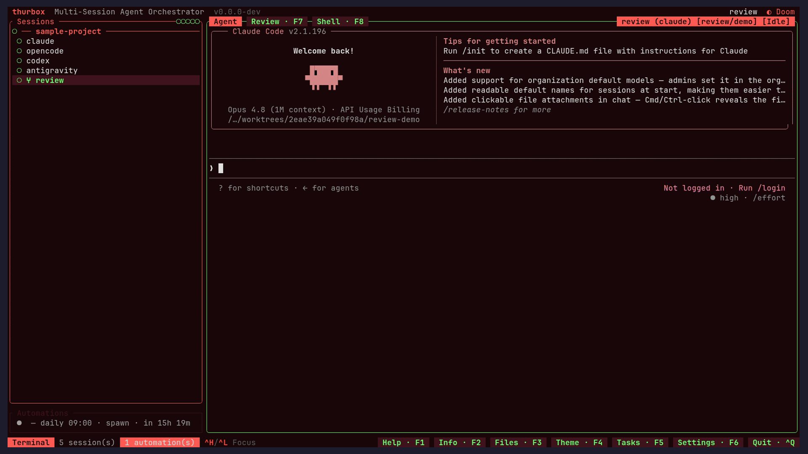

# Thurbox

Run any coding-agent CLI in persistent terminal sessions.
Thurbox is a multi-session TUI orchestrator that launches
Claude Code, Codex, Gemini CLI, opencode, aider — or any agent
you describe — inside persistent tmux panes that survive
crashes, restarts, and reboots. Sessions, agents, and git
worktrees are first-class citizens.

[](https://github.com/Thurbeen/thurbox/actions)
[](https://opensource.org/licenses/MIT)
[](https://thurbox.thurbeen.eu/)
[](https://sonarcloud.io/summary/new_code?id=Thurbeen_thurbox)



## Why Thurbox

Running a coding agent in several terminals gets you far — until
you want to keep sessions alive across crashes, isolate them
per-branch, or juggle different agents side-by-side. Thurbox
adds:

- **Persistence** — sessions live in tmux and survive Thurbox
  crashes, restarts, and reboots. Reattach from any terminal with
  `tmux -L thurbox attach`.
- **Parallelism** — many agents side-by-side, each on its own
  repo(s) and branch, each running the agent you chose.
- **Any agent** — a session runs one coding-agent CLI selected at
  creation time. Built-ins (claude, codex, gemini, opencode,
  aider) are seeded into `~/.config/thurbox/agents.toml`; add your
  own without recompiling.
- **Git worktree isolation** — each session can spawn on a fresh
  worktree; `Ctrl+S` syncs them with `origin/main` and asks the
  agent to resolve rebase conflicts automatically.

## Main Features

### Sessions

- Persistent tmux-backed panes, parallel agents, per-session
  working dirs.
- Each session runs one coding agent; nothing else is configured
  per session. Each agent runs with its own default config.
- `Ctrl+R` restart preserves the conversation when the agent
  supports resume; `Ctrl+F` forks a session; `Ctrl+T` toggles a
  shell pane.
- Fuzzy session search (`/`), clickable URLs, mouse selection +
  clipboard, scheduled commands (`Ctrl+P`), soft-delete with undo
  (`Ctrl+Z`) and restore (`Ctrl+U`).

### Agent definitions

- Agents are declared as data in `~/.config/thurbox/agents.toml`,
  seeded with built-ins on first run and user-extensible. Each
  agent has a `command`, `args` (always passed — bake in flags
  like a model here if you want), and argument-template groups
  (`resume_args`, `fork_args`, `new_session_args`). Each group is
  appended only when its value is present, with `{id}`
  substituted.

### Git worktrees

- Pick "Worktree" in the new-session flow to branch off a base and
  launch the agent inside the worktree. Closing the session removes
  it. `Ctrl+S` syncs all worktree sessions with `origin/main`.

### Responsive UI

- `< 80` cols: terminal only · `>= 80`: sidebar + terminal ·
  `>= 120`: sidebar + terminal + info panel. Vim-inspired keys
  throughout. Pick a theme with `Ctrl+Y` (or `F4`).

## Prerequisites

- **tmux >= 3.2**
- **A coding-agent CLI** — e.g.
  [claude](https://github.com/anthropics/claude-code), codex,
  gemini, opencode, or aider (whichever agents you plan to run)
- **git** (required for worktree features)
- **Rust 1.75+** (only to build from source)

## Installation

**One-liner (recommended):**

```bash
curl -fsSL https://raw.githubusercontent.com/Thurbeen/thurbox/main/scripts/install.sh | sh
```

Installs the latest release to `~/.local/bin` with checksum
verification and platform auto-detection.

**Options:**

```bash
# Custom directory
INSTALL_DIR=/usr/local/bin curl -fsSL https://raw.githubusercontent.com/Thurbeen/thurbox/main/scripts/install.sh | sh

# Pin a version
VERSION=v0.1.0 curl -fsSL https://raw.githubusercontent.com/Thurbeen/thurbox/main/scripts/install.sh | sh
```

**From source:**

```bash
git clone https://github.com/Thurbeen/thurbox.git
cd thurbox
cargo build --release
# binary at target/release/thurbox
```

## Getting Started

1. **Launch** — run `thurbox`. You'll see a sidebar on the left
   listing your sessions and a terminal panel on the right.
2. **Create your first session** — press `Ctrl+N` to open the repo
   picker. Toggle repos with `Space`; press `w` on a repo to mark
   it as worktree mode (you'll be prompted for a base branch and
   new branch name). Confirm with `Enter`, name the session, then
   pick an **agent**. The agent picker is skipped when only one
   agent is defined.
3. **Work with the agent** — the right pane is a live agent
   session. All keys are forwarded to the PTY; `Ctrl+C` copies if
   you have a selection, otherwise sends SIGINT.
4. **Navigate** — `Ctrl+J` / `Ctrl+K` move between sessions in the
   sidebar; `Ctrl+L` / `Ctrl+H` cycle focus between panes.
   `Ctrl+O` opens the session's worktree in your editor.
5. **Quit without killing** — `Ctrl+Q` detaches all sessions.
   Tmux keeps them running; relaunch `thurbox` and they resume.

See the full [keybindings](#keybindings) below.

## Agents

A session launches exactly one coding-agent CLI. Agents are
described as data in `~/.config/thurbox/agents.toml`, which is
seeded with built-ins (claude, codex, gemini, opencode, aider) on
first run. Edit the file to tweak an agent or add a new one — no
recompile required.

Each `[[agents]]` entry maps the resume / fork / new-session ids
onto argument-template groups. `args` is always passed (bake in
any flags you want, e.g. a model); the resume / fork /
new-session groups are appended only when their driving value is
present, with `{id}` substituted token-by-token:

```toml
default = "claude"

[[agents]]
name = "claude"
command = "claude"
resume_args = ["--resume", "{id}"]
fork_args = ["--resume", "{id}", "--fork-session"]
new_session_args = ["--session-id", "{id}"]

[[agents]]
name = "codex"
command = "codex"
```

## Common Workflows

- **Parallel branches** — `Ctrl+N`, pick a repo in Worktree mode,
  name a new branch. Repeat for a second branch. Two isolated
  agents now work in parallel with no git contention.
- **Mix agents** — run Claude Code on one repo and Codex on
  another in side-by-side sessions; each session remembers its own
  agent.
- **Recover a crash** — if Thurbox dies, relaunch it: sessions
  resume from tmux. Prefer raw tmux? `tmux -L thurbox attach`.

## Keybindings

### Global Keys

| Key | Action | Mnemonic |
|-----|--------|----------|
| `Ctrl+Q` | Quit (detach sessions) | **Q**uit |
| `Ctrl+N` | New session (opens repo picker) | **N**ew |
| `Ctrl+C` | Copy selection / SIGINT (terminal) | **C**opy |
| `Ctrl+V` | Paste from clipboard | Paste |
| `Ctrl+P` | Scheduled commands (list/cancel/new) | **P**rogram |
| `Ctrl+T` | Toggle shell pane | **T**erminal |
| `Ctrl+H` | Focus previous pane (cycle backward) | Vim: **h** = left |
| `Ctrl+J` | Select next session | Vim: **j** = down |
| `Ctrl+K` | Select previous session | Vim: **k** = up |
| `Ctrl+L` | Focus next pane (cycle forward) | Vim: **l** = right |
| `Ctrl+D` | Delete session | Vim: **d** = delete |
| `Ctrl+O` | Open active session's repos in editor | **O**pen |
| `Ctrl+R` | Restart active session | **R**estart |
| `Ctrl+F` | Fork active session | **F**ork |
| `Ctrl+S` | Sync worktrees with origin/main | **S**ync |
| `Ctrl+Z` | Undo session delete | **Z** = undo |
| `Ctrl+U` | Restore deleted sessions | **U**ndelete |
| `Ctrl+Y` / `F4` | Pick TUI theme | Color **Y**oke |
| `F1` | Help overlay | Universal |
| `F2` | Toggle info panel | Next to F1 |
| `F3` | Toggle file viewer | Next to F2 |

### List Navigation

| Key | Action |
|-----|--------|
| `j` / `Down` | Next item |
| `k` / `Up` | Previous item |
| `/` | Fuzzy search (projects or sessions) |
| `Enter` | Select / focus |

Session search matches against name, agent, and branch.

### Terminal Scrollback and Selection

| Key | Action |
|-----|--------|
| `Shift+Up` / `Shift+Down` | Scroll 1 line |
| `Shift+PageUp` / `Shift+PageDown` | Scroll half page |
| Mouse wheel | Scroll 3 lines |
| Mouse drag | Select text |
| Any other key | Snap to bottom + forward to PTY |

## Headless CLI (`thurbox-cli`)

The `thurbox-cli` binary drives Thurbox without the TUI — useful
for scripting and automation. It shares the same SQLite database
as the TUI, so changes appear live.

```bash
cargo build --bin thurbox-cli
thurbox-cli session list
thurbox-cli session create \
  --name reviewer \
  --repo-path /path/to/repo \
  --agent codex
thurbox-cli session send <uuid> "run the test suite"
thurbox-cli session capture <uuid>
```

`session create` takes `--name`, `--repo-path`, `--agent`,
`--worktree-branch`, and `--base-branch`; the agent falls back to
the default in `agents.toml` when omitted.

## Architecture

Thurbox follows **The Elm Architecture** (TEA):
`Event → Message → update(model, msg) → view(model) → Frame`.
All state lives in a single `App` model. Sessions run via a
`SessionBackend` trait backed by local tmux (`tmux -L thurbox`).
Terminal output is parsed by `vt100::Parser` and rendered by
`tui_term`. All persistent state (sessions, worktrees, scheduled
commands) is stored in SQLite.

### Module Dependency Rules

```text
session  ← pure data types, no local imports
agent    ← imports session only (NEVER ui or git)
ui       ← imports session only (NEVER agent or git)
app      ← coordinator, imports all modules
```

These rules are enforced by `tests/architecture_rules.rs`.
For the full set of architectural decisions with rationale,
see [docs/ARCHITECTURE.md](docs/ARCHITECTURE.md).

## Documentation

- [docs/CONSTITUTION.md](docs/CONSTITUTION.md) — Core principles
  and non-negotiable rules
- [docs/ARCHITECTURE.md](docs/ARCHITECTURE.md) — Architectural
  decisions with rationale
- [docs/FEATURES.md](docs/FEATURES.md) — Feature-level design
  choices (including agent definitions)

## Development

### Setup

```bash
git clone https://github.com/Thurbeen/thurbox.git
cd thurbox
prek install   # Install pre-commit hooks
```

All required dev tools are documented in `Cargo.toml` under
`[package.metadata.dev-tools]`. Run `./scripts/install-dev-tools.sh`
to install them, or install individually with `cargo install`.

### Build and Run

```bash
cargo build                          # Debug build
cargo build --release                # Release build (LTO, stripped)
cargo run                            # Run in dev mode
```

### Testing

```bash
cargo nextest run --all              # Run all tests (preferred)
cargo nextest run -E 'test(name)'    # Single test by name
cargo test --test architecture_rules # Architecture validation
bats scripts/install.bats            # Install script tests
```

### Code Quality

```bash
cargo fmt --all                      # Format (100 char max)
cargo clippy --all-targets --all-features -- -D warnings
RUSTDOCFLAGS="-D warnings" cargo doc --no-deps --all-features
rumdl check .                        # Markdown lint
```

### Architecture Checks

```bash
cargo test --test architecture_rules # Module dependency rules
cargo deny check advisories          # Security advisories
cargo deny check bans licenses sources  # Dependency policy
```

## Committing Changes

This project uses
[Conventional Commits](https://www.conventionalcommits.org/).

```bash
cog commit feat "add worktree management"
cog commit fix "resolve memory leak" cli
```

### Commit Types

- `feat`: New features (minor version bump)
- `fix`: Bug fixes (patch version bump)
- `docs`, `refactor`, `test`, `chore`, `perf`, `ci`, `style`,
  `build`, `revert`: No release

### Valid Scopes

`api`, `cli`, `ui`, `git`, `core`, `docs`, `deps`, `config`

## Contributing

1. Fork the repository
2. Create a feature branch
3. Make your changes following our coding standards
4. Write tests for new functionality
5. Ensure all tests pass: `cargo nextest run --all`
6. Use conventional commits: `cog commit <type> "message"`
7. Submit a pull request

### Code Style

- Follow Rust naming conventions
- Maximum line width: 100 characters
- Use `rustfmt` for formatting
- Address all `clippy` warnings

## License

This project is licensed under the MIT License - see the
[LICENSE](LICENSE) file for details.

## Acknowledgments

- [Ratatui](https://github.com/ratatui-org/ratatui) — TUI
  framework
- [tui-term](https://github.com/a-kenji/tui-term) — terminal
  widget for ratatui
- [vt100](https://github.com/doy/vt100-rust) — terminal
  emulation
- [Claude Code CLI](https://github.com/anthropics/claude-code)
  — one of the supported coding agents
- [tmux](https://github.com/tmux/tmux) — terminal multiplexer

## Support

For issues, questions, or contributions, please visit our
[GitHub repository](https://github.com/Thurbeen/thurbox).
