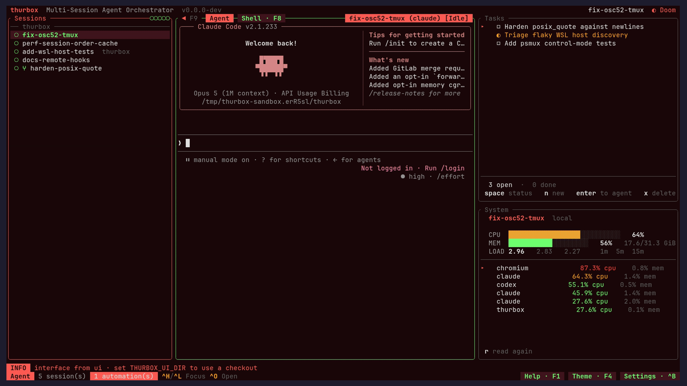
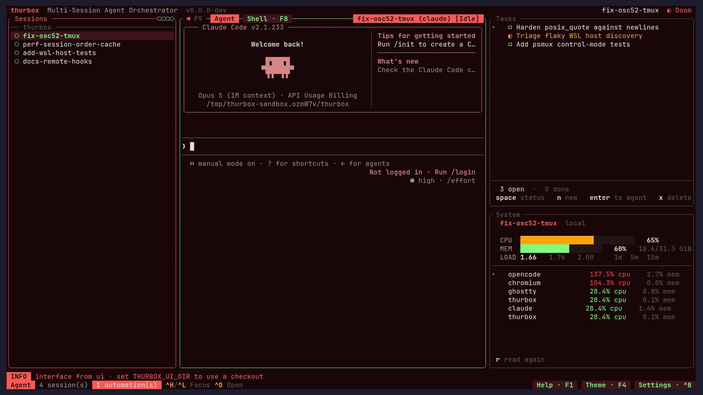
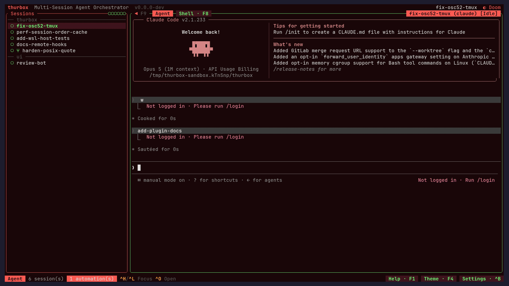
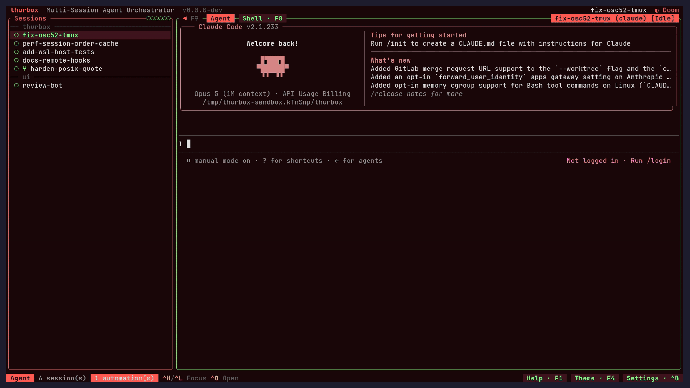

# Thurbox

<div align="center">
  
</div>

Run any coding-agent CLI — Claude Code, Codex, Antigravity, opencode, aider, or
one you describe yourself — side by side in persistent tmux sessions, each on
its own git worktree. Sessions survive crashes, restarts and reboots.

Every pane you see is a Lua file in a directory you own, the session list
included. Move it, turn it off, rewrite it, or install one somebody else wrote.
**[Customization →](#customization)**

[](https://github.com/Thurbeen/thurbox/actions)
[](https://opensource.org/licenses/MIT)
[](https://thurbox.thurbeen.eu/)
[](https://discord.gg/fGumcHaxFY)
[](https://sonarcloud.io/summary/new_code?id=Thurbeen_thurbox)



## Installation

**Linux / macOS:**

```bash
curl -fsSL https://raw.githubusercontent.com/Thurbeen/thurbox/main/scripts/install.sh | sh
```

**Windows (PowerShell):**

```powershell
irm https://raw.githubusercontent.com/Thurbeen/thurbox/main/scripts/install.ps1 | iex
```

That installs both binaries — `thurbox` (the TUI) and `thurbox-cli` (the
headless one) — with checksum verification and platform auto-detection, to
`~/.local/bin` on Linux/macOS and `%LOCALAPPDATA%\Programs\thurbox` (added to
your user `PATH`) on Windows.

<details>
<summary><b>Other ways to install</b> — Homebrew · AUR · winget · Chocolatey · from source</summary>

**Homebrew (macOS Apple Silicon / Linux x86_64):**

```bash
brew install thurbeen/thurbox/thurbox
```

**Arch Linux (AUR):**

```bash
paru -S thurbox-bin   # prebuilt binary (fastest)
paru -S thurbox       # build from source
```

**winget / Chocolatey (Windows x86_64):**

```powershell
winget install Thurbeen.thurbox
choco install thurbox
```

Both need [psmux](https://github.com/psmux/psmux) installed separately. Both
channels are manually moderated, so thurbox publishes to each at most once
every 30 days; the PowerShell installer and
[GitHub Releases](https://github.com/Thurbeen/thurbox/releases) have every
version immediately.

**From source:**

```bash
git clone https://github.com/Thurbeen/thurbox.git
cd thurbox
cargo build --release   # binaries at target/release/
```

**Pin a version or change the install directory:**

```bash
# `export` on its own line: in `VERSION=… curl … | sh` the assignment binds to
# curl, and the sh reading from the pipe never sees it.
export VERSION=v2.5.4
export INSTALL_DIR=/usr/local/bin
curl -fsSL https://raw.githubusercontent.com/Thurbeen/thurbox/main/scripts/install.sh | sh
```

PowerShell uses `$env:THURBOX_VERSION` / `$env:THURBOX_INSTALL_DIR` the same way.

</details>

## Prerequisites

- **tmux >= 3.2** (Linux / macOS), or **[psmux](https://github.com/psmux/psmux)**
  on native Windows — a drop-in tmux clone thurbox drives identically
- **A coding-agent CLI** — e.g.
  [claude](https://github.com/anthropics/claude-code), codex, antigravity,
  opencode, or aider
- **git** (required for worktree features)
- **Rust 1.75+** (only to build from source)

## Getting Started

> **New here?** [**docs/TUTORIAL.md**](docs/TUTORIAL.md) walks the first ten
> minutes with screenshots.

```bash
thurbox
```

On first launch thurbox seeds its config — the agents it knows, the themes, and
the interface itself — into `~/.config/thurbox/`, then draws a session list on
the left and an agent terminal on the right.

1. **Create a session** — `Ctrl+N` opens the repo picker. Toggle repos with
   `Space`, press `w` on a repo for worktree mode (you are prompted for a base
   branch and a new branch name), confirm with `Enter`, name the session, then
   pick an agent.
2. **Work with the agent** — the right pane is a live agent session. All keys go
   to it; `Ctrl+C` copies if you have a selection, otherwise sends SIGINT.
3. **Navigate** — `Ctrl+J` / `Ctrl+K` move between sessions, `Ctrl+L` / `Ctrl+H`
   cycle focus between panes, `Ctrl+/` searches sessions *and the text on their
   screens*. `Ctrl+O` opens the session's worktree in your editor.
4. **Quit without killing** — `Ctrl+Q` detaches. Tmux keeps every agent running;
   relaunch `thurbox` and they are all still there, or attach raw with
   `tmux -L thurbox attach`.
5. **Make it yours** — `Ctrl+,` then `]` lists every pane and lets you turn one
   off; `Ctrl+Y` changes the palette; `F1` rebinds any chord but the five
   reserved ones; `F10` reloads the interface from disk.

`F1` renders the live keybinding registry, so it cannot drift. The full table is
under [Keybindings](#keybindings).

## Features

### Sessions

Many coding agents side by side, each in its own tmux-backed pane that survives
crashes, restarts and reboots. Pick the agent and repo(s) at `Ctrl+N`. Reorder
by hand (`Shift+J` / `Shift+K`), sort (`Shift+S`), restart with resume
(`Ctrl+R`), or soft-delete (`Ctrl+D`), undoable with `Ctrl+Z`.


### A customizable interface

Every pane is a Lua file under `ui/` — move it, turn it off, delete it, rewrite
it, or install one someone else wrote, and the arrangement closes up around what
is left. `F10` reloads from disk. A pane is handed a snapshot and returns a
tree: no filesystem, no network, no process unless you trust it.
[Customization →](#customization)



### Global search

`Ctrl+/` searches sessions by name, agent, branch and repo — and by the text on
their screens, which is the half that finds a session by the error in it.
Matches highlight inside the panes being searched; `Esc` puts back what you were
looking at.


### Fork and lead/worker trees

`Ctrl+F` forks a session and records the source as its parent; children nest
under their lead in the list. Build trees by hand or headlessly with `--parent`.
The link is informational — deleting a lead never cascades to its workers.



### Themes

Thirty-six palettes (twenty-eight dark, eight light) plus your own in
`themes.toml`, switched live with `Ctrl+Y` (or `F4`) and persisted across
restarts. Plugins ask for *roles* (`theme.accent`, `theme.muted`) rather than
colours, so a pane you write looks right under all thirty-six.



### Also in the box

- **Git worktree isolation** — spawn a session on a fresh worktree branch;
  `Ctrl+S` syncs worktrees with their base branch, and reports a conflict
  without changing that worktree.
- **Multi-repo sessions** — one session can span several repos, each in its own
  worktree on a shared branch, gathered into a symlink workspace the agent runs
  in.
- **[Remote SSH and WSL sessions](docs/CONFIG.md)** — declare hosts in
  `hosts.toml` and they become `ssh:<name>` / `wsl:<name>` backends with the
  same persistence and restore as local ones.
- **[Automations](#automations-alias-auto)** *(CLI only)* — named, scheduled
  agent runs (cron, or `hourly` / `daily` / `weekdays` / `weekly`) that send a
  prompt to a running session or spawn a fresh one. A tmux heartbeat keeper
  fires them whether or not thurbox is open.
- **[Tasks](#tasks-alias-todo)** *(CLI only)* — a todo list whose items can be
  handed to a coding agent with the same send/spawn model.
- **[Inter-session messages](#messages-alias-msg)** — an agent-neutral mailbox
  queue for agent↔agent coordination, with atomic exactly-once `--claim` drains.
  Agents pass no ids; thurbox injects a stable identity.
- **[Extensions](https://thurbeen.github.io/thurbox/docs/extensions.html)**
  *(experimental)* — opt-in, agent-agnostic add-ons that are data, not code:
  `flow`, `forge`, `ci-shepherd`, `renovate`. One command installs, activates
  and self-heals each.
- **[Session lifecycle hooks](docs/CONFIG.md#hookstoml)** — your own commands,
  run before and after a session is created, deleted, restarted or restored
  (`hooks.toml`). A pre-hook can refuse the operation.
- **[OS notifications](docs/CONFIG.md)** — desktop alerts when a session needs
  you, with click-to-focus on Linux.
- **Mouse support** — clickable rows and buttons, wheel scrolling,
  drag-to-select, `Ctrl+Click` on URLs. Toggle with `mouse` in `settings.toml`.
- **Installable panes** — a code reviewer
  ([`thurbox-code-review`](https://github.com/Thurbeen/thurbox-code-review)), an
  info panel with live CPU/RAM
  ([`thurbox-info-panel`](https://github.com/Thurbeen/thurbox-info-panel)), or
  anything else somebody publishes.

## Comparison

Lots of tools now run coding agents in parallel, each in its own git worktree.
They mostly differ on what is underneath: whether the session backend is real
tmux or a re-implemented multiplexer, whether the UI is a TUI or an
Electron/native app, whether they launch the unmodified vendor CLI, and whether
one session can span several repos.

| Tool | Interface | Session backend | Agents | Multi-repo session | Code review | Platforms | Remote / SSH | License |
|------|-----------|-----------------|--------|--------------------|-------------|-----------|--------------|---------|
| **Thurbox** | TUI — **editable Lua panes** | **Real tmux** (+ psmux on Windows) | **Any CLI** — data in `agents.toml` | **✓** (one session, many repos) | **✓** (in-TUI diff, as an installable pane) | Linux · macOS · Windows | **✓** (SSH hosts) | MIT |
| [GitHub Copilot App](https://github.com/github/app) | Desktop GUI | App-managed (worktrees + GitHub cloud envs) | Copilot (GitHub's agent) | ✗ | Agent Merge (PR review) | Linux · macOS · Windows | GitHub-hosted cloud envs | Proprietary (paid Copilot) |
| [Conductor](https://www.conductor.build/) | Native GUI | App-managed PTY | Claude, Codex, Cursor | ✗ | Visual diff (GUI) | macOS only | Cloud Workspaces | Free (closed source) |
| [Herdr](https://herdr.dev/) | TUI | **Own** multiplexer (Rust) | Claude, Codex + many (any CLI) | ✗ | ✗ | Linux · macOS | Runs on a remote box | AGPL-3.0 |
| [1Code](https://github.com/21st-dev/1code) | Desktop GUI | App-managed PTY | Claude, Codex | ✗ | Visual diff (GUI) | macOS · Windows · Linux | Cloud agents | Apache-2.0 |
| [Orca](https://www.onorca.dev/) | Desktop GUI (Electron) | App-managed PTY | Claude, Codex, Gemini, Cursor + many (any CLI) | ✗ | Visual diff (GUI) | macOS · Windows · Linux | Remote Orca servers | MIT |
| [Claude Squad](https://github.com/smtg-ai/claude-squad) | TUI | **Real tmux** | Claude, Codex, OpenCode, Aider, Amp | ✗ | Git diff view | Linux · macOS (no Windows) | ✗ | AGPL-3.0 |
| [Cursor](https://cursor.com/) | IDE + cloud | App-managed (its **own** models) | Composer + frontier models | ✗ | IDE review | macOS · Windows · Linux | Cloud VMs + SSH | Proprietary (paid) |

Where thurbox sits on those axes:

- **The interface is a directory of Lua files**, not a UI you configure at the
  edges — rearrange it, switch a pane off, or replace one, while it runs.
- **Real tmux**, so sessions survive crashes and reboots and you can reattach
  from any terminal. A custom multiplexer is one more thing that can lose them.
- **A TUI**, so it runs in a plain terminal, over SSH, on a headless server.
- **The unmodified vendor CLI** — thurbox knows nothing about an agent's model,
  prompts or tools, so you get new agent features the day the CLI ships them.
- **Agents as data** in `agents.toml`; adding a CLI needs no recompile.
- **Multi-repo sessions**, each repo in its own worktree on a shared branch.
  Plain non-git directories work too (`--add-dir`).

Feature accuracy as of June 2026; check each project for the latest. The table
is a curated subset, not a leaderboard — see
[awesome-agent-orchestrators](https://github.com/andyrewlee/awesome-agent-orchestrators)
for the wider field.

## Customization

The binary boots a kernel, reads a directory, and draws whatever Lua it finds
there. Everything the tool *is* — its panes, its agents, its hosts, its colours,
its chords — is a file you can open in an editor.

| What you change | Where |
|---|---|
| A pane — the session list included | `ui/plugins/*.lua` |
| Where the panes go, and at what widths | `ui/layout.lua` |
| Which panes load at all | `Ctrl+,` → Interface tab (`]`) |
| A pane that broke the interface | the same tab — `r` to restore, `space` to turn off |
| Panes somebody else wrote | `ui/plugins.toml` → `thurbox-cli plugin sync` |
| Which agent CLIs you can launch | `agents.toml` |
| Remote SSH machines and WSL distros | `hosts.toml` |
| Commands around a session's lifecycle | `hooks.toml` |
| Colours | `Ctrl+Y`, or `themes.toml` |
| Chords | the `F1` editor, or `ui.json` |
| Core and plugin settings | `Ctrl+,`, or `settings.toml` |

All of it lives under `~/.config/thurbox/`. Panes and the arrangement reload on
`F10` or when you save; colours, chords and most settings apply live (the
settings panel marks the restart-only ones `⟳`); a changed agent applies to the
next session you create; a new agent, and any change to `hosts.toml` or
`themes.toml`, needs a restart.

### Writing a pane

```bash
thurbox-cli plugin dir          # which interface directory is live, and why
thurbox-cli plugin new notes    # a starter that already loads
thurbox-cli plugin check        # load it the way thurbox does; non-zero on failure
thurbox-cli plugin list         # the same inventory the Interface tab shows
```

A plugin is handed a snapshot and returns a tree of four node kinds (`text`,
`box`, `input`, `surface`); everything else composes from those. Reads come from
an in-memory snapshot and return instantly, writes are commands the kernel picks
up — so no pane can stall the render loop on SQLite, git, or an unreachable
host.

**Capabilities are granted by absence.** `io`, `os`, `debug`, `package` and the
loaders are simply not in a plugin's environment, and the linter enforces that
statically. Running a program is two separate capabilities — `run` for a
bounded, captured command (`git status`, `docker compose ps`) and `program` for
a real interactive pane (`htop`, `lazygit`) — each declared in the plugin's
header and granted only after you trust the file (settings → Interface → `t`),
keyed to its digest, so a trusted file that changes reads `trusted · modified`.
This is not a sandbox; thurbox can only refuse to run things unasked. See
[docs/PLUGINS.md](docs/PLUGINS.md) and [docs/V2-KERNEL.md](docs/V2-KERNEL.md).

### Installing panes

```bash
thurbox-cli plugin install top                                          # by name
thurbox-cli plugin install git+https://github.com/Thurbeen/thurbox-code-review
thurbox-cli plugin sync                                                 # converge to the spec
```

`plugin install` records each entry in `plugins.toml` with the commit it
resolved to in `plugins.lock`, so `plugin sync` reproduces the same interface on
another machine. Your edits to an installed pane are kept, and a pane you delete
is remembered as deleted rather than reinstalled.

Installing a pane does not place it: `ui/layout.lua` decides where a slot goes,
and that edit stays yours. A pane that loads but which no arrangement places
draws nothing while looking healthy — `thurbox-cli plugin check` is what fails
on that, and prints the line to add.

Three files record three different questions: `.bundled.json` what delivery did
(bundled · edited · yours · removed · installed), `ui.json` what you decided
(panes turned off, panes trusted, chords rebound), and `plugins.toml` /
`plugins.lock` what the interface is composed of and what each entry resolved
to. Deleting a bundled pane is how you remove it — the removal is recorded and
never written back.

### Asking an agent to do it

You do not have to learn Lua to change the interface. Thurbox ships a built-in
`ui-skill` extension: a `thurbox-ui` skill that loads in whichever CLI you run
when the request is about the interface. From any session, ask:

> - *Add a pane on the left with CPU and RAM usage. There is a `top` example
>   plugin — install it and give it a slot in the layout.*
> - *Move the search strip to the bottom and make the session column 30% wide.*
> - *The session list is too noisy — drop the repo group headers and show the
>   branch instead of the agent name.*

The skill tells the agent that `thurbox-cli plugin dir` finds the directory and
`thurbox-cli plugin check` verifies its own work. Press `F10` and the change is
on your screen.

`thurbox-cli` is on the agent's `PATH` too, so the same holds for sessions
themselves — creating a fleet, sending prompts, scheduling automations. Both
binaries share one SQLite database, so anything an agent does shows up in your
running TUI within a tick.

### When a pane breaks the interface

Editing the thing you are looking at means it can break, so the way back is
chrome rather than a pane: `Ctrl+,` → `]` cannot be edited away by anything in
the directory. A file that failed to load sorts to the top of that list with its
error underneath.

| The file | The way back |
|---|---|
| a pane thurbox ships, edited or deleted | `r` — the shipped copy comes out of the binary |
| a pane **you** wrote | `space` — off, untouched on disk, and the interface loads without it |
| an installed pane (`from <src>`) | `thurbox-cli plugin sync` |
| the whole directory | it never loaded, so the embedded copies are running — fix the file from inside them |

`r` cannot restore a file thurbox never shipped, and says so instead of
guessing. `space` is also the key for bisecting which of several files is at
fault. Both reload immediately.

With no terminal to trust, `thurbox-cli plugin check` reports the same failure
and exits non-zero. Full detail:
[docs/PLUGINS.md → When something goes wrong](docs/PLUGINS.md#when-something-goes-wrong).

## Agents

A session launches exactly one coding-agent CLI. Agents are described as data in
`~/.config/thurbox/agents.toml`, seeded with built-ins (claude, codex,
antigravity, opencode, aider, copilot, vibe, pi, omp) on first run. Edit the
file to tweak an agent or add a new one — no recompile.

Each `[[agents]]` entry maps the resume / fork / new-session ids onto
argument-template groups. `args` is always passed (bake in any flags you want,
e.g. a model); the other groups are appended only when their driving value is
present, with `{id}` substituted token-by-token:

```toml
default = "claude"

[[agents]]
name = "claude"
command = "claude"
resume_args = ["--resume", "{id}"]
fork_args = ["--resume", "{id}", "--fork-session"]
new_session_args = ["--session-id", "{id}"]

[[agents]]
name = "codex"
command = "codex"
```

## Common Workflows

- **Parallel branches** — `Ctrl+N`, pick a repo in worktree mode, name a new
  branch. Repeat for a second branch. Two isolated agents now work in parallel
  with no git contention.
- **Mix agents** — run Claude Code on one repo and Codex on another side by
  side; each session remembers its own agent.
- **Recover a crash** — relaunch thurbox: sessions resume from tmux. Or attach
  raw with `tmux -L thurbox attach`.

### Recipe: provision a monorepo headless

Three roles with different blast radius — operators with read/write access to a
prod backoffice, developers with read-only access, and reviewers doing
continuous review — provisioned by one script:

```bash
#!/usr/bin/env bash
set -euo pipefail
REPO="${REPO:-/home/me/code/monorepo}"
N_OPERATORS="${N_OPERATORS:-1}"
N_DEVELOPERS="${N_DEVELOPERS:-2}"
N_REVIEWERS="${N_REVIEWERS:-1}"
HOST="${HOST:-}"                          # e.g. devbox to run remotely; empty = local
STAMP="$(date +%y%m%d-%H%M)"

host_flag() { [ -n "$HOST" ] && printf -- '--host\n%s\n' "$HOST"; }

for i in $(seq 1 "$N_OPERATORS"); do
  thurbox-cli session create --name "operator-$i" --repo-path "$REPO" \
    --agent operator --worktree-branch "ops/$STAMP-$i" $(host_flag)
done

for i in $(seq 1 "$N_DEVELOPERS"); do
  thurbox-cli session create --name "developer-$i" --repo-path "$REPO" \
    --agent developer --worktree-branch "dev/$STAMP-$i" $(host_flag)
done

# Reviewers get no worktree: they review the repo as-is.
for i in $(seq 1 "$N_REVIEWERS"); do
  id="$(thurbox-cli session create --name "reviewer-$i" --repo-path "$REPO" \
        --agent reviewer $(host_flag) --json | jq -r '.id')"
  thurbox-cli session send "$id" \
"You are a continuous security & code-quality reviewer for this monorepo.
Loop: pick the most recently changed files, review for security issues,
correctness bugs, and quality regressions. Do not modify code — review only."
done

thurbox-cli session list
```

The three roles are just agents in `agents.toml` that launch `claude` with a
different `--mcp-config`, so the read/write vs read-only split lives entirely in
those MCP config files:

```toml
[[agents]]
name = "operator"                 # prod backoffice: read/write
command = "claude"
args = ["--mcp-config", "/home/me/.config/thurbox/mcp/backoffice-rw.json"]
new_session_args = ["--session-id", "{id}"]
resume_args      = ["--resume", "{id}"]
fork_args        = ["--resume", "{id}", "--fork-session"]
```

Scale knobs are env vars — `N_DEVELOPERS=3 ./provision.sh` — and
`HOST=devbox ./provision.sh` runs every session's worktree and tmux on a remote
machine from `hosts.toml`. For one session across several repos, add
`--add-repo PATH@main` (its own worktree per repo) or `--add-dir PATH`.

## Keybindings

Every chord goes through one registry: the kernel owns a few, and each pane
declares its own. **`F1` is authoritative** — it renders the registry, so it
cannot drift from what is running.

| Key | Action | Owner |
|-----|--------|-------|
| `Ctrl+Q` | Quit (sessions keep running) | kernel |
| `Ctrl+H` / `Ctrl+L` | Focus back / forward through the ring | kernel |
| `Ctrl+C` / `Ctrl+V` | Copy selection / paste (`Cmd+C`/`Cmd+V` too, on macOS) | kernel |
| `F1` / `Ctrl+G` | Keybindings help | kernel |
| `F6` / `Ctrl+,` | Settings (`]` for the Interface tab) | kernel |
| `F4` / `Ctrl+Y` | Theme picker | kernel |
| `Ctrl+P` | Command palette — every action, filtered as you type | kernel |
| `F10` | Reload the interface from disk | kernel |
| `F12` | Perf HUD | kernel |
| `Ctrl+N` | New session | `70_new_session.lua` |
| `Ctrl+/` | Search sessions, and their screens | `65_search.lua` |
| `Ctrl+T` / `F8` | A shell beside the agent | `20_agent.lua` |
| `j` `k` / `Ctrl+J` `Ctrl+K` | Next / previous session | `10_sessions.lua` |
| `Enter` | Open the session | `10_sessions.lua` |
| `Shift+J` / `Shift+K` | Move it down / up | `10_sessions.lua` |
| `Shift+S` | Sort by name within each repo group | `10_sessions.lua` |
| `d` / `Ctrl+D` | Delete (reversible) | `10_sessions.lua` |
| `Shift+D` | Delete it *and* its worktree, confirming if work is at risk | `10_sessions.lua` |
| `Ctrl+Z` | Undo the last delete | `10_sessions.lua` |
| `Ctrl+U` | Restore a deleted session | `80_restore.lua` |
| `r` / `Ctrl+R` | Restart the agent | `10_sessions.lua` |
| `Ctrl+F` | Fork | `10_sessions.lua` |
| `Ctrl+S` | Sync worktrees with their base | `10_sessions.lua` |
| `Ctrl+O` | Open in your editor | `10_sessions.lua` |
| `F9` | Hide the session list | `10_sessions.lua` |

Every chord except the five reserved ones (`Ctrl+Q`, `F10`, `Ctrl+H`, `Ctrl+L`,
`F12` — the way out of a pane that consumes every key) is rebindable from the
`F1` editor; rebindings persist to `~/.config/thurbox/ui.json`, beside the
plugins you have turned off and the ones you trust. A chord already claimed by
an overlapping action is reassigned to your binding; a chord freed by a pane you
removed stays unbound.

**macOS:** in kitty-protocol terminals (iTerm2 3.5+, kitty, WezTerm, Ghostty)
the Command key works as a modifier, and any action can be rebound to a `cmd+…`
chord. Copy and paste ship on `Cmd+C` / `Cmd+V` there as well as on the Ctrl
pair, because `Ctrl+C` in a terminal means interrupt. Terminal.app delivers no
Cmd chords; everything else works there.

### Terminal scrollback and selection

| Key | Action |
|-----|--------|
| `PageUp` / `PageDown` | Scroll the agent's output by 10 lines |
| Mouse drag | Select text |

## Headless CLI (`thurbox-cli`)

`thurbox-cli` drives thurbox without the TUI. It shares the same SQLite database
and `tmux -L thurbox` server, so changes made by either appear live in the other
(the TUI polls `PRAGMA data_version`).

Output is human-readable by default and switches to JSON automatically when
stdout is piped (so `… | jq` keeps working); force a format with `--json`
(compact), `--pretty` (indented JSON), or `--text` (human even when piped).

### Sessions

```bash
thurbox-cli session list                 # all active sessions
thurbox-cli session get <uuid>           # one session by UUID
thurbox-cli session create \
  --name reviewer \
  --repo-path /path/to/repo \
  --agent codex \
  --worktree-branch feat/x \
  --base-branch main \
  --host devbox          # optional — run on a remote host from hosts.toml
thurbox-cli session send <uuid> "run the test suite"
thurbox-cli session send <uuid> "steer it here" --no-enter  # typed, not sent
thurbox-cli session key <uuid> enter     # ...and now submit it
thurbox-cli session key <uuid> escape    # interrupt the turn (or ctrl-c)
thurbox-cli session capture <uuid> --lines 500
thurbox-cli session capture <uuid> --ansi --json   # styled text + pane state
thurbox-cli session restart <uuid>       # kill + re-spawn with --resume
thurbox-cli session delete <uuid>        # soft-delete (see below)
thurbox-cli session restore <uuid>       # undo a soft-delete
```

`create` runs synchronously — the tmux window is live by the time it returns.
`--agent` falls back to the default in `agents.toml`; `--worktree-branch` (off
`--base-branch`, default `main`) creates a git worktree; `--host` creates the
worktree and tmux window on that remote host over SSH. `send` types text into
the session's terminal followed by Enter; `capture` dumps the rendered pane
(`--lines` defaults to 200, max 10000). `--ansi` keeps tmux's styling in that
text instead of flattening it; plain text stays the default.

`send --no-enter` types the text and stops, leaving it unsubmitted in the
agent's composer — the half a type-then-verify-then-submit integration needs,
since submitting on the way in fires every steer the instant it is typed. The
text is delivered as one bracketed paste either way, so it arrives literally: no
shell sees it, and a leading `-`, quotes and newlines survive intact (put `--`
before the arguments when the text itself starts with a dash).

`key` sends one named special key: `enter`, `escape`, `tab`, `backspace`,
`space`, `up`, `down`, `left`, `right`, `home`, `end`, `page-up`, `page-down`,
`delete`, or `ctrl-<letter>`. Spelling is forgiving — `ctrl-c`, `ctrl+c` and
`C-c` are the same key, and case does not matter — but a name thurbox does not
know is **refused** rather than passed on, because tmux types an unrecognized
key name into the pane as text. `escape` and `ctrl-c` interrupt a turn, `ctrl-u`
clears a composer line, `enter` submits what `send --no-enter` typed. `send` and
`key` drive **this machine's** tmux server, so a session created with `--host`
is refused by name: run `thurbox-cli` on that host instead.

`capture --json` also reports the pane's *live* state, so an integrator reading
a session's screen never has to drive `tmux` itself:

| field | what it is |
|---|---|
| `cursor_row` / `cursor_col` | cursor position, 0-based, relative to the visible pane (tmux `#{cursor_y}` / `#{cursor_x}`) |
| `foreground_process` | argv0 of the process holding the pane's tty |
| `foreground_command` | that process's **full** command line — what tells `node …/cursor-agent/cli.js` from a bare `node` |
| `foreground_cwd` | where that process is *now* (tmux `#{pane_current_path}`), unlike `session get`'s `cwd`, which is where the session was launched |

Every one is `null` when it cannot be determined, never guessed. Resolving the
foreground process needs a `ps` that reports `tpgid`; without one
`foreground_process` falls back to tmux's command *name* and
`foreground_command` is `null`. `capture` reads the **local** multiplexer only,
so a session created with `--host` — whose pane lives on that host's own tmux
server — is refused by name rather than reported empty.

**Deleting.** `session delete <uuid>` is a soft-delete: it only marks the
database row. A running TUI kills the tmux window once the 10-second undo
window closes; the worktrees stay, which is what makes `session restore <uuid>`
lossless.

Pass `--force` to tear down the runtime resources in the same call, for headless
cleanup with no TUI running. It kills the tmux window, removes the session's git
worktrees (the underlying repos are left intact), removes the multi-repo symlink
workspace if any, and disables `send` automations targeting the session.
Teardown is best-effort: individual failures are recorded in the JSON report
(`killed_window`, `removed_worktrees`, `worktree_errors`,
`disabled_automations`) but never abort the delete, and the row is always
soft-deleted last.

### Automations (alias `auto`)

```bash
thurbox-cli automation create \
  --name nightly-triage \
  --trigger weekdays --time 09:00 \
  --session <uuid> --prompt "triage new issues"
thurbox-cli automation list
thurbox-cli automation show <id>
thurbox-cli automation edit <id> --prompt "..." --disabled
thurbox-cli automation remove <id>
thurbox-cli automation run <id>          # mark due for the next tick
thurbox-cli automation runs <id> --limit 20   # run history
thurbox-cli automation tick              # fire all due automations now
```

`--trigger` accepts `hourly`, `daily`, `weekdays`, `weekly`, `cron:"<expr>"`, or
`at:<unix_millis>`. A `--session` makes it a *send* automation; a `--repo` (with
optional `--worktree` / `--base` / `--agent`) makes it a *spawn* automation;
`--command` makes it a headless shell job. `automation tick` is the entry point
the tmux heartbeat keeper and any systemd/cron timer call.

### Tasks (alias `todo`)

```bash
thurbox-cli task create --title "audit deps" --description "markdown notes"
thurbox-cli task list
thurbox-cli task show <id>
thurbox-cli task edit <id> --status done   # --description "" clears notes
thurbox-cli task remove <id>
thurbox-cli task run <id>                   # trigger its Send/Spawn action
```

`create` with neither `--session` nor `--repo` is a plain local todo; adding
either (with optional `--worktree` / `--base` / `--agent`) connects it to a
coding agent like an automation.

### Messages (alias `msg`)

```bash
thurbox-cli message send --to flow --kind questions --body "scope?"
thurbox-cli message reply <message_id> --body "go ahead"
thurbox-cli message inbox --for flow --claim   # atomic, exactly-once drain
thurbox-cli message prune --older-than-days 14
```

Run *inside* a session, `send` / `reply` / `inbox` default their sender, task
and recipient to the caller's injected identity (`THURBOX_SESSION` /
`THURBOX_TASK`), so an agent passes no ids. `send` and `reply` wake the
recipient by default (`--no-wake` to suppress).

### Interface (`plugin`)

```bash
thurbox-cli plugin dir                # which directory is live, and which rule chose it
thurbox-cli plugin new <name>         # write a starter pane that already loads
thurbox-cli plugin check              # load it the way thurbox does; non-zero on failure
thurbox-cli plugin list               # the inventory the Interface tab shows
thurbox-cli plugin install <src>      # a bare name, a URL, a path, or git+<url>
thurbox-cli plugin sync               # converge the directory to plugins.toml
thurbox-cli plugin update [<name>]    # re-resolve and re-deliver
thurbox-cli plugin remove <name>      # withdraw it, remembering the removal
thurbox-cli plugin available          # the example panes a bare name resolves to
```

See [Customization](#customization) and [docs/PLUGINS.md](docs/PLUGINS.md).

### Extensions (alias `ext`)

```bash
thurbox-cli extension install <name|url|dir>   # install + activate
thurbox-cli extension list                     # installed, with staleness flags
thurbox-cli extension available [query]        # built-ins, with install commands
thurbox-cli extension status <name>            # one extension's health
thurbox-cli extension update [--all] [--force] # refresh payload (no name => all)
thurbox-cli extension reinstall <name>         # clean-slate uninstall + install
thurbox-cli extension activate <name>          # (re)create its sessions/automations
thurbox-cli extension deactivate <name>        # tear them down (real off-switch)
thurbox-cli extension uninstall <name> [--purge]
```

A bare `<name>` resolves against the official source, pinned to your binary's
release tag so the fetched extension matches the binary. Installed extensions
self-heal — their declared sessions and automations are re-ensured at TUI
startup and on every headless `automation tick` — so `deactivate`, not deleting
the session, is the way to turn one off.

### Editor and config

```bash
thurbox-cli editor get                   # print the command Ctrl+O runs
thurbox-cli editor set "code --wait"     # set (empty string clears)
thurbox-cli config validate              # strict-parse every config file
thurbox-cli config show                  # print the effective resolved config
```

The worktree path is appended to the editor command as its final argument.
`config validate` is handy in dotfiles CI; see
[docs/CONFIG.md](docs/CONFIG.md) for every config file in one place.

## Uninstall

Remove the binary, depending on how you installed it:

```bash
rm ~/.local/bin/thurbox        # curl one-liner / manual install
brew uninstall thurbox         # Homebrew
paru -R thurbox thurbox-bin    # Arch (AUR)
winget uninstall Thurbeen.thurbox  # winget (Windows)
choco uninstall thurbox        # Chocolatey (Windows)
```

Sessions outlive thurbox in tmux, so stop them too:

```bash
tmux -L thurbox kill-server    # ends all running agent sessions
```

To also delete state and config (this erases your session history, theme and
`agents.toml`):

```bash
rm -rf ~/.local/share/thurbox ~/.config/thurbox
```

## Architecture

The interface is Lua running on a Rust kernel. `thurbox` boots the kernel, which
reads `ui/` and renders whatever plugins it finds; there is no built-in pane.
Sessions run via a `SessionBackend` trait backed by tmux over a transport
(local, SSH, or WSL); terminal output is parsed by `vt100::Parser` and rendered
by `tui_term`. All persistent state (sessions, worktrees, automations, tasks,
messages) is stored in SQLite.

Five rules hold the kernel together:

1. **Four node kinds, forever** — `text`, `box`, `input`, `surface`. Everything
   else composes in Lua.
2. **Layout resolves before render** — rects are computed first, then each
   plugin is called with its own. Panes declare their size statically, which is
   what breaks the circularity.
3. **Snapshot-read, command-write** — reads return instantly from an in-memory
   snapshot; writes are commands accepted now and surfaced later. Lua never
   blocks.
4. **Capabilities by absence** — an ungranted capability is not *in* the
   environment, and the linter enforces that statically.
5. **Anything touching the world runs on a worker** — terminal attach, commands,
   diffs, metrics, git stats, repository reads, update checks.

### Module dependency rules

```text
session  ← pure data types, no crate-internal references
agent    ← session (+ paths/shell utils; NEVER git)
kernel   ← session + storage + sync + paths + session_ops + git
main     ← the coordinator: the loop, the workers, the chrome
```

Enforced by `tests/architecture_rules.rs` as an allowlist: a new module fails
the test until its place is declared. Full rationale in
[docs/ARCHITECTURE.md](docs/ARCHITECTURE.md); the kernel itself is in
[docs/V2-KERNEL.md](docs/V2-KERNEL.md).

## Documentation

- [docs/TUTORIAL.md](docs/TUTORIAL.md) — Onboarding walkthrough with
  screenshots
- [docs/CONSTITUTION.md](docs/CONSTITUTION.md) — Core principles and
  non-negotiable rules
- [docs/ARCHITECTURE.md](docs/ARCHITECTURE.md) — Architectural decisions with
  rationale
- [docs/FEATURES.md](docs/FEATURES.md) — Feature-level design choices
- [docs/CONFIG.md](docs/CONFIG.md) — Every config file, env var and DB setting
  in one place
- [docs/V2-KERNEL.md](docs/V2-KERNEL.md) — The plugin kernel: its shape, its
  five rules, and the traps in changing it
- [docs/PLUGINS.md](docs/PLUGINS.md) — Writing an interface plugin
- [docs/DEVELOPMENT.md](docs/DEVELOPMENT.md) — The dev environment: Nix flake,
  `just` tasks, the sandbox
- [docs/RELEASING.md](docs/RELEASING.md) — What a release may and may not change
  about the artifacts

## Development

The dev environment is a reproducible Nix flake (`nix develop` /
`direnv allow`) with `just` tasks and an isolated runtime sandbox
(`scripts/dev/sandbox.sh`). See [docs/DEVELOPMENT.md](docs/DEVELOPMENT.md).

```bash
git clone https://github.com/Thurbeen/thurbox.git
cd thurbox
prek install                         # pre-commit hooks

just build                           # cargo build --bin thurbox --bin thurbox-cli
just test                            # cargo nextest run --all
just lint                            # fmt, clippy, deny, rumdl, shellcheck, Lua gates
```

Without Nix, `./scripts/install-dev-tools.sh` installs the tools listed in
`Cargo.toml` under `[package.metadata.dev-tools]`.

## Committing Changes

This project uses
[Conventional Commits](https://www.conventionalcommits.org/), enforced by
cocogitto in a pre-commit hook.

```bash
cog commit feat "add worktree management"
cog commit fix "resolve memory leak" cli
```

`feat` bumps the minor version and `fix` / `perf` the patch; `docs`, `refactor`,
`test`, `chore`, `ci`, `style`, `build` and `revert` cut no release. Valid
scopes: `api`, `cli`, `ui`, `git`, `core`, `docs`, `deps`, `config`, `mcp`.

## Contributing

1. Clone the repository and create a feature branch — push it directly if you
   have write access, otherwise fork first and branch there
2. Make your changes; keep lines under 100 chars and `clippy` clean
3. Write tests for new functionality
4. Ensure `cargo nextest run --all` passes
5. Commit with `cog commit <type> "message"` and open a pull request

See [CONTRIBUTING.md](CONTRIBUTING.md) for the full guide.

## License

MIT — see [LICENSE](LICENSE).

## Acknowledgments

- [Ratatui](https://github.com/ratatui-org/ratatui) — TUI framework
- [tui-term](https://github.com/a-kenji/tui-term) — terminal widget for ratatui
- [vt100](https://github.com/doy/vt100-rust) — terminal emulation
- [tmux](https://github.com/tmux/tmux) — terminal multiplexer

## Community & Support

- **[Discord](https://discord.gg/fGumcHaxFY)** — questions, setup help, and
  showing off your interface. Ask in `#help`, one thread per problem.
- **[GitHub Issues](https://github.com/Thurbeen/thurbox/issues)** — confirmed
  bugs and concrete feature requests.
- **[Contributing](CONTRIBUTING.md)** — everything about getting a change
  merged.
