# Thurbox tutorial: your first sessions

A walk through the first ten minutes of thurbox — from an empty screen to two
coding agents running side by side, each on its own git worktree, plus the
handful of commands you will use every day.

Every screenshot below is the real TUI, captured by driving it through this
exact sequence (`scripts/demo/record-tutorial.sh`). The paths in them
(`/tmp/tutorial-home/code/…`) come from the throwaway sandbox the capture runs
in; yours will be your own `~/code`, `~/src`, or wherever you keep repositories.

**Contents**

- [Before you start](#before-you-start)
- [1. Launch it](#1-launch-it)
- [2. Add a repository](#2-add-a-repository)
- [3. Give the session its own worktree](#3-give-the-session-its-own-worktree)
- [4. Name it and pick an agent](#4-name-it-and-pick-an-agent)
- [5. You have a session](#5-you-have-a-session)
- [6. The second session is faster](#6-the-second-session-is-faster)
- [Everyday keys](#everyday-keys)
- [The same thing from the command line](#the-same-thing-from-the-command-line)
- [Where to go next](#where-to-go-next)

## Before you start

Install thurbox (both binaries — the TUI `thurbox` and the headless
`thurbox-cli`):

```bash
curl -fsSL https://raw.githubusercontent.com/Thurbeen/thurbox/main/scripts/install.sh | sh
```

Windows is `irm https://raw.githubusercontent.com/Thurbeen/thurbox/main/scripts/install.ps1 | iex`;
Homebrew, AUR, winget and Chocolatey are in the
[README](../README.md#installation).

You also need:

- **tmux ≥ 3.2** (or [psmux](https://github.com/psmux/psmux) on native Windows) —
  it is what keeps your agents alive when thurbox is closed
- **git**
- **at least one coding-agent CLI** — `claude`, `codex`, `agy`, `opencode`,
  `aider`, `copilot`, … thurbox launches whichever you have; it is not tied to
  any of them

Nothing to configure. On first launch thurbox seeds `~/.config/thurbox/` with
the agents it knows, the themes, and the interface itself.

## 1. Launch it

```bash
thurbox
```

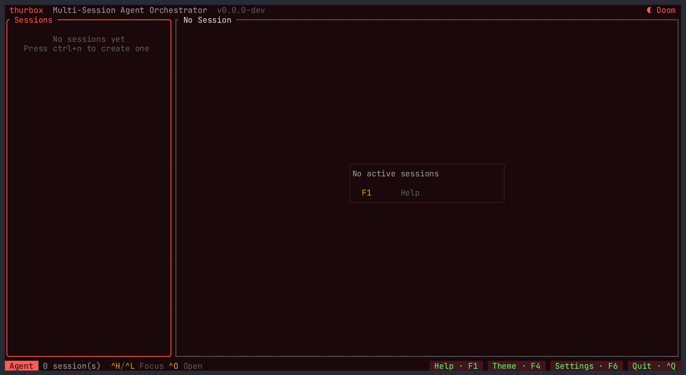

Two panes between two bars: the **session list** on the left, the **agent
terminal** on the right, and the keys you need on the footer. There are no
sessions yet, so the list says so.

## 2. Add a repository

Press **`Ctrl+N`**. The creation flow opens on the repo step.

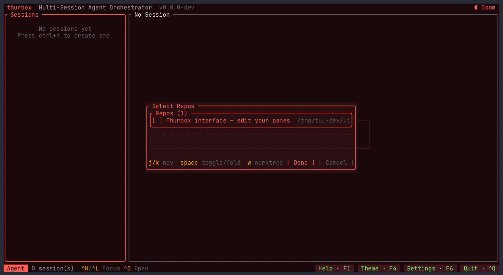

The list is thurbox's **repo memory** — the repositories you have used before.
On a fresh install it holds one row you did not add: your own interface
directory, offered because editing the panes is a thing you might want a session
for.

To add a repository, press **`Tab`** to move to the **Add Repo Path** field and
type a path. `~` is expanded for you:

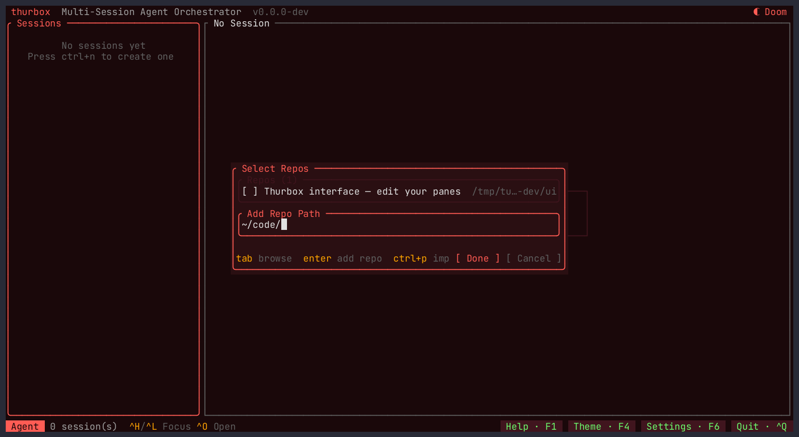

Two ways to finish from here:

- **`Enter`** adds the path you typed, if it is a repository.
- **`Tab`** browses instead — a listing of that directory, marking which
  subdirectories are git repositories:

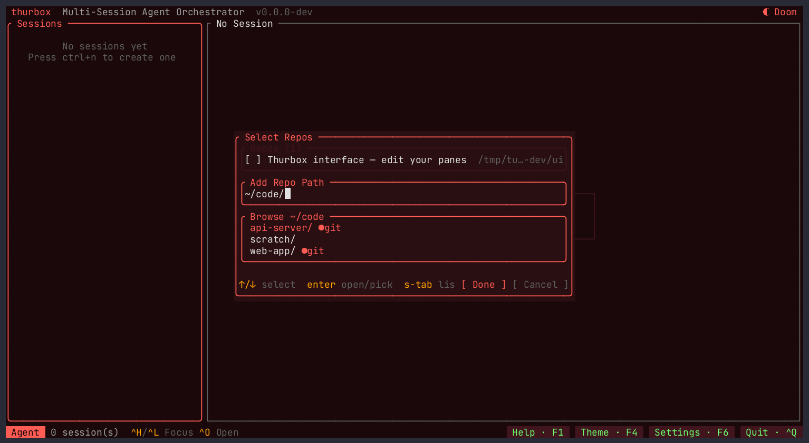

`↑`/`↓` move, `Enter` on a `●git` row picks it (`Enter` on a plain folder
descends into it).

Either way the repository lands in memory, **selected** (`[x]`), with the cursor
on it — and stays there for next time:


The footer names the rest of what this step does, all on the list:

| Key | What it does |
|---|---|
| `space` | select / deselect a repository (select several for a **multi-repo** session) |
| `w` | give the selected repository its own **worktree** |
| `/` | filter a long list |
| `d` | forget a remembered repository |
| `Alt+P` | import a **folder of repositories** at once — type a parent path, press `Alt+P`, and every git subdirectory is added under one header |
| `Tab` | move between the list and the path field |

## 3. Give the session its own worktree

With the repository selected, press **`w`**. The `[wt]` mark means this session
gets a **git worktree of its own** rather than your checkout — the agent works
on its own branch, in its own directory, and your working tree is untouched.

![The selected repository marked [wt] for worktree mode](../media/tutorial/06-worktree-mode.png)

Press **`Enter`** when the selection is right. Because a worktree needs
something to branch from, the next step asks which branch:

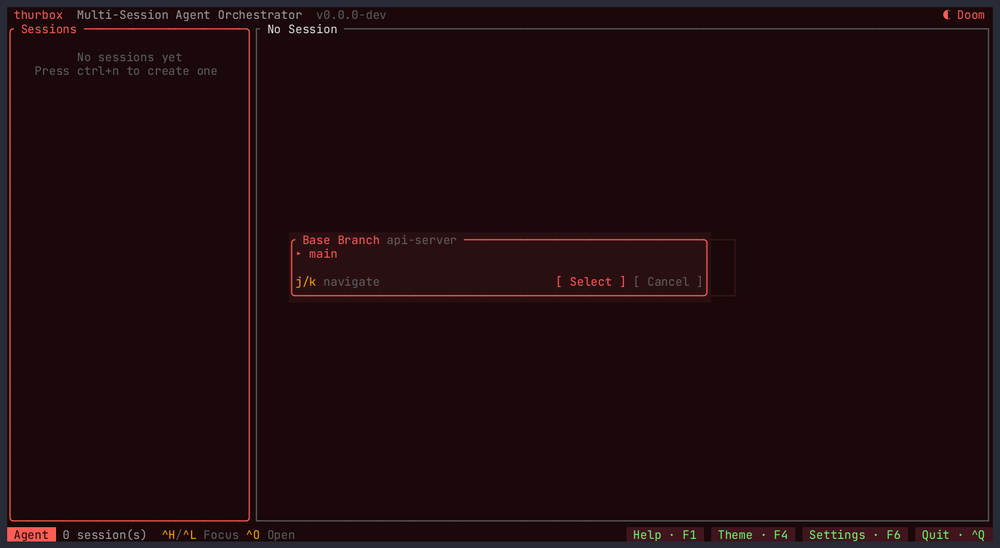

`j`/`k` navigate, `Enter` selects. (Without worktree mode this step does not
appear at all — the session simply runs in the repository as it is.)

## 4. Name it and pick an agent

Name the session after the **work**, not the tool — the list reads as a backlog
that way. `Enter` on an empty field accepts the suggested name (the
repository's own), so you can press straight through.

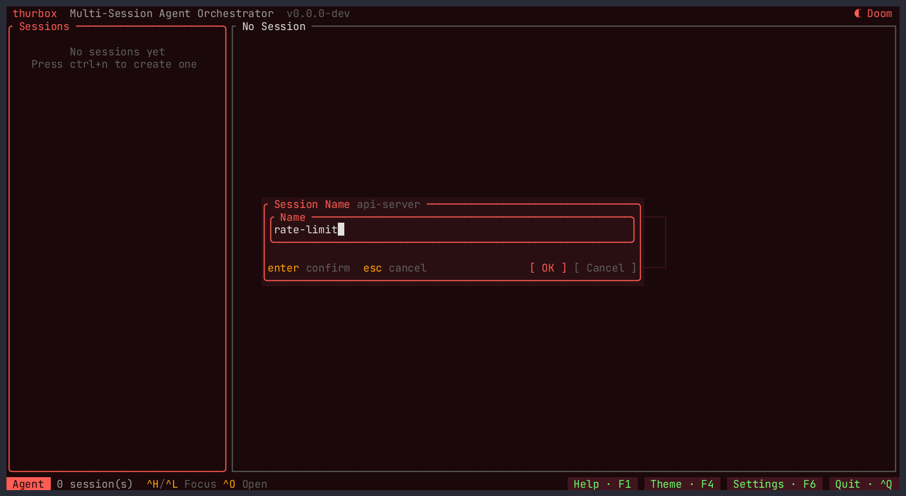

The branch name comes next, prefilled from the name you just gave:


Then the agent. This is the list from `~/.config/thurbox/agents.toml` — the
built-ins thurbox seeds, plus any CLI you have described yourself. (With only
one agent defined, this step is skipped.)

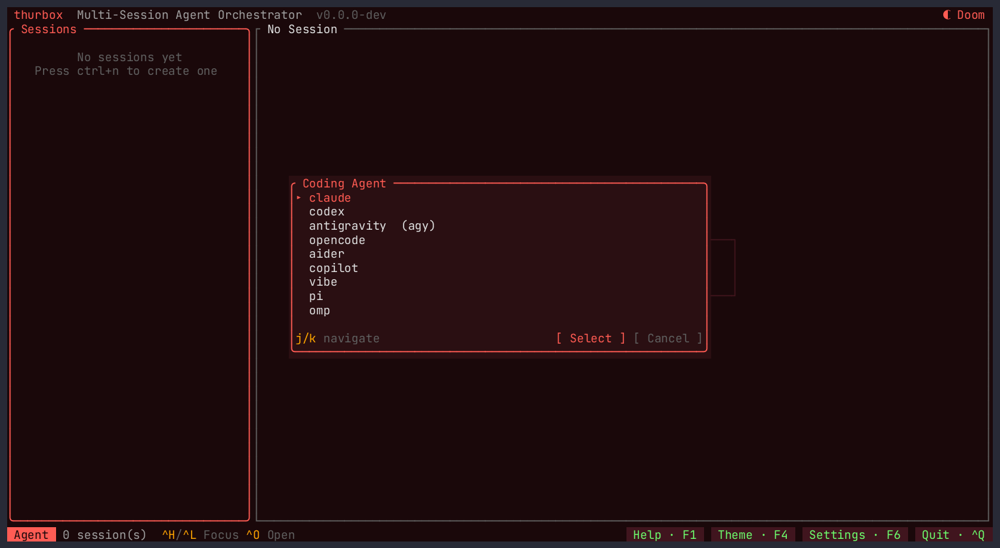

`Enter` creates everything: the worktree, the tmux window, and the agent
running inside it.

## 5. You have a session

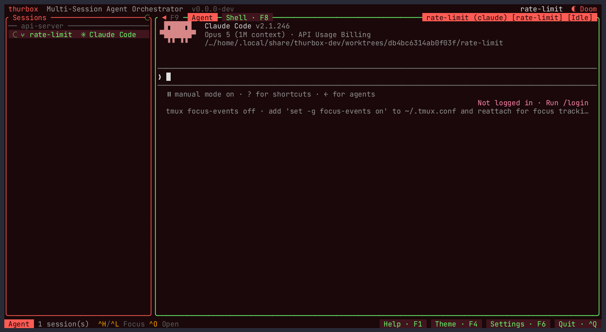

What you are looking at:

- the session row, grouped under its **repository** (`api-server`), with the
  `⑂` worktree mark, its agent, and a status dot
- the **agent terminal** on the right — a real terminal. Everything you type
  goes to the agent; `Ctrl+O` opens the worktree in your editor, and
  `Ctrl+T`/`F8` gives you a shell in the same directory
- the status dot tracks the agent through **working / blocked / done / idle**,
  reported by the agent's own hooks rather than guessed

Press **`Ctrl+Q`** whenever you like: it detaches. tmux keeps every agent
running, and relaunching `thurbox` puts you back where you were — after a crash,
a reboot, or a week away.

## 6. The second session is faster

`Ctrl+N` again. The repository is in memory now, so there is nothing to type:
`space` to select it, `Enter`, and through the same steps.

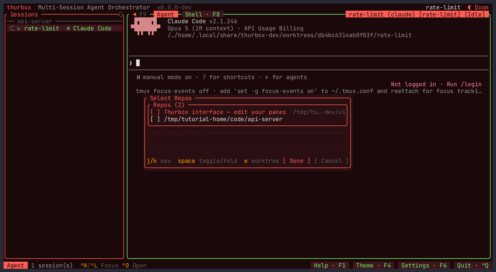

That is the shape of a working day — one session per piece of work, each on its
own branch, all alive at once.

## Everyday keys

The authoritative list is **`F1`** (or `Ctrl+G`), which renders the live key
registry, so it can never drift from what is actually bound. Every chord in it
is rebindable from that screen.

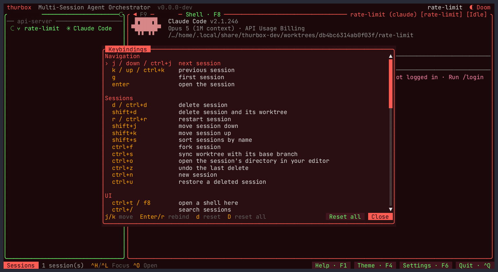

The ones worth knowing on day one:

| Key | Action |
|---|---|
| `Ctrl+N` | New session |
| `Ctrl+J` / `Ctrl+K` | Select the next / previous session |
| `Ctrl+H` / `Ctrl+L` | Move focus between panes (the way out of a focused agent) |
| `Ctrl+/` | Search sessions **and the text on their screens** |
| `Ctrl+O` | Open the session's directory in your editor |
| `Ctrl+T` / `F8` | A shell in the session's directory |
| `Ctrl+F` | Fork the session — same repo, branch and agent, with the conversation carried over and the source recorded as its parent |
| `Ctrl+S` | Sync the worktree with its base branch |
| `Ctrl+D` | Delete the session (`Ctrl+Z` undoes it) |
| `Ctrl+U` | Restore a deleted session |
| `Ctrl+Y` / `F4` | Theme picker (36 palettes) |
| `Ctrl+,` / `F6` | Settings — `]` for the Interface tab |
| `F10` | Reload the interface from disk |
| `Ctrl+Q` | Quit, leaving every agent running |

`Ctrl+/` is the one to remember when the list gets long: it matches names,
agents, branches and repositories — and the text on each session's screen, which
is how you find the session with the error in it. Matches highlight **inside**
the panes rather than being reprinted:

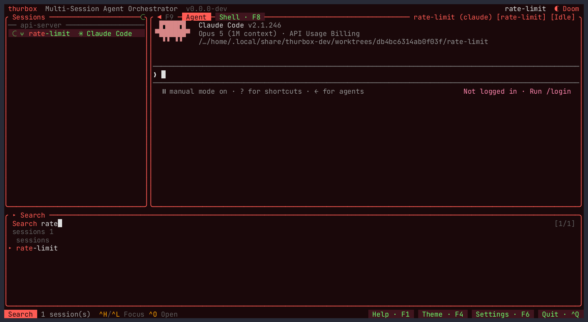

## The same thing from the command line

`thurbox-cli` drives the same sessions with no TUI, against the same database —
so anything you do here shows up in a running thurbox within a tick, and vice
versa. It is on your `PATH` inside every session, which is what lets an agent
orchestrate other agents.

```bash
# What is running
thurbox-cli session list
thurbox-cli session list --json | jq       # JSON is automatic when piped

# Start one headlessly, on its own worktree branch
thurbox-cli session create --name docs --repo-path ~/code/web-app
thurbox-cli session create --name rate-limit --repo-path ~/code/api-server \
    --agent claude --worktree-branch rate-limit

# Talk to one, and read what it printed
thurbox-cli session send <uuid> "run the tests and fix what fails"
thurbox-cli session capture <uuid>

# Clean up (soft by default — `session restore` brings it back)
thurbox-cli session delete <uuid>
```

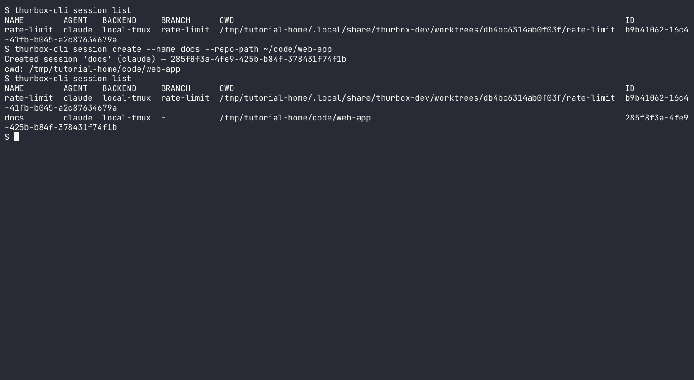

Everything else lives under the same tree: `thurbox-cli config show` prints
every resolved path, `thurbox-cli plugin dir` prints the interface directory,
and `thurbox-cli --help` lists the rest (`automation`, `task`, `message`,
`extension`, `editor`, `notify`).

## Where to go next

- **Make it yours** — every pane is a Lua file in a directory you own. Ask an
  agent in any session to change it, or read
  [docs/PLUGINS.md](PLUGINS.md). `Ctrl+,` then `]` lists every pane and turns
  one off; `F10` reloads.
- **Run a fleet** — [Recipe: provision a monorepo headless](../README.md#recipe-provision-a-monorepo-headless)
  and [docs/ORCHESTRATION.md](ORCHESTRATION.md).
- **Work on another machine** — declare an SSH host or a WSL distro in
  `~/.config/thurbox/hosts.toml` and sessions run there while the TUI stays
  local ([docs/CONFIG.md](CONFIG.md)).
- **Configure it** — [docs/CONFIG.md](CONFIG.md) is every config file, env var
  and setting in one place; [docs/FEATURES.md](FEATURES.md) is why each one
  behaves the way it does.

Regenerate every screenshot on this page with:

```bash
scripts/demo/record-tutorial.sh
```
